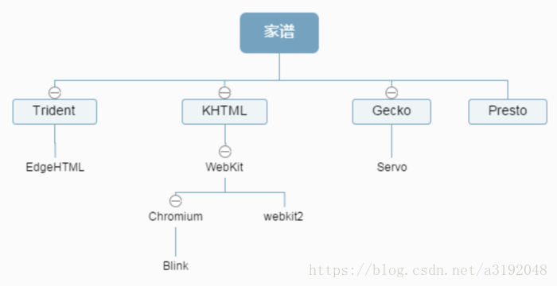
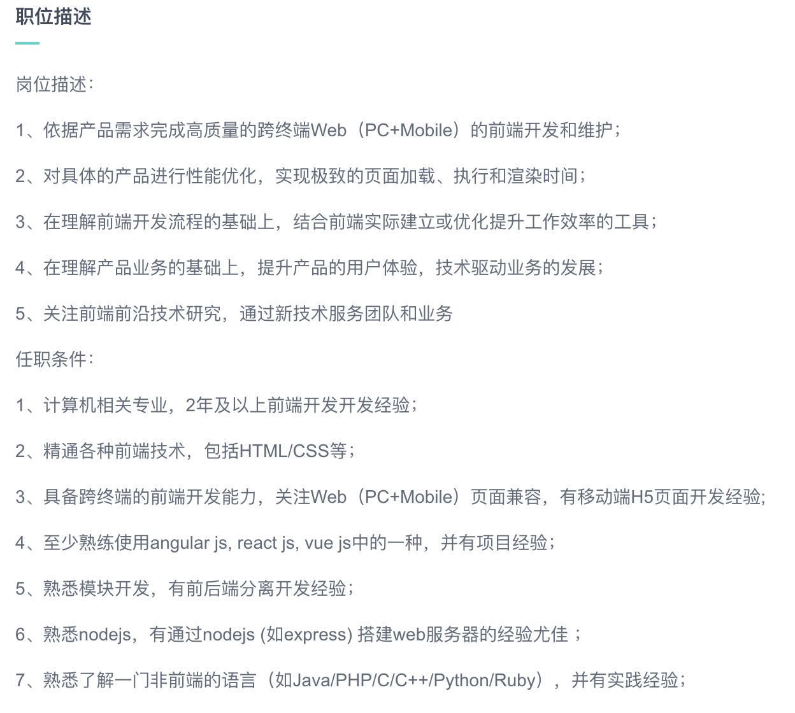
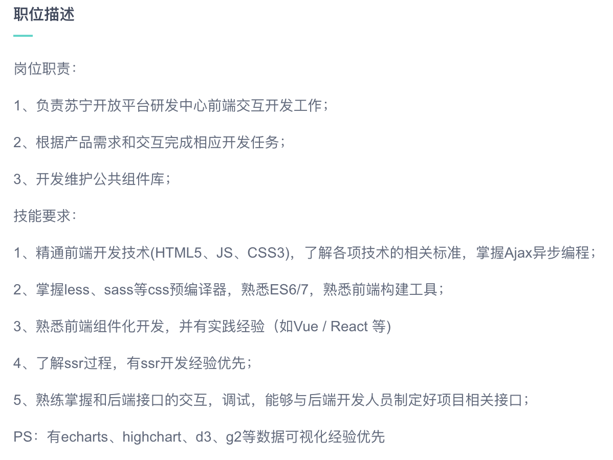
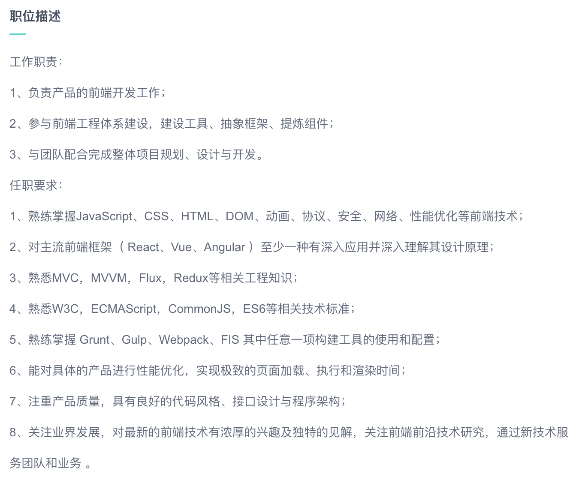
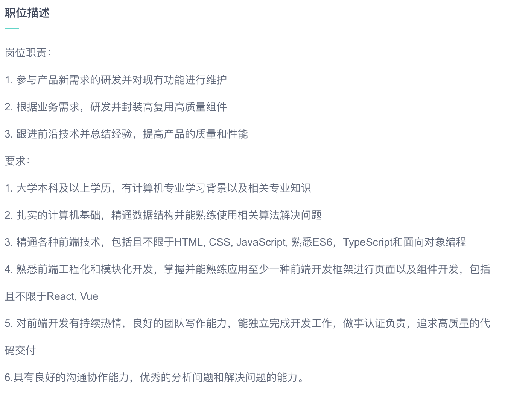
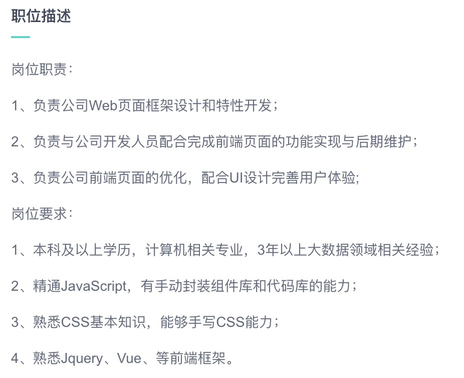
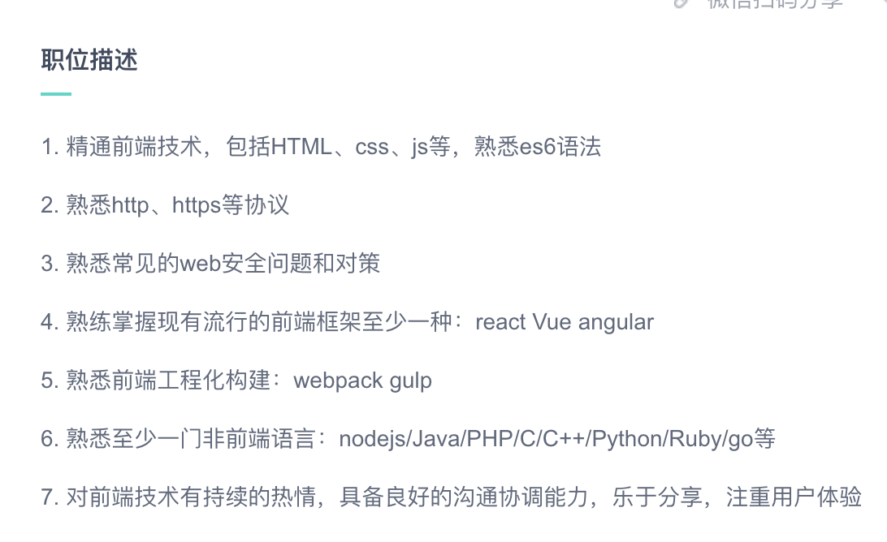

## 学习计划

[TOC]

### 基础

#### 浏览器发展

世界上第一个浏览器 WorldWideWeb（后改名Nexus）

第一个网页服务器httpd

Web之父 Tim Berners-Lee

主流浏览器

| 时间 | 名称    | 发表人/组织 |
| ---- | ------- | ----------- |
| 1996 | IE      | 微软        |
| 1996 | Opera   | Telenor公司 |
| 2003 | safari  | 苹果公司    |
| 2004 | firefox | Mozilla组织 |
| 2008 | chrome  | 谷歌公司    |

主流浏览器内核介绍

| 名称                  | 开发公司                       | 使用的浏览器                                                 |
| --------------------- | ------------------------------ | ------------------------------------------------------------ |
| Trident（IE内核）     | 微软公司                       | IE、360                                                      |
| Gecko（Firefox 内核） | Mozilla组织                    | 火狐                                                         |
| Webkit（Safari 内核） | 苹果公司                       | safari、360极速、chrome高速、搜狗高速<br />手机浏览器：safari，安卓默认浏览器 |
| blink                 | Google和Opera Software联合开发 | Chrome（28及往后版本），Opera（15及往后版本），Yandex，vivaldi |



浏览器内核（Rendering Engine）

内核可以分为两部分：渲染引擎和JS引擎。

渲染引擎：负责取得网页的内容（HTML、XML、图像等等）、整理讯息（例如加入 CSS 等），以及计算网页的显示方式，然后会输出至显示器或打印机。浏览器的内核的不同对于网页的语法解释会有不同，所以渲染的效果也不相同。所有网页浏览器、电子邮件客户端以及其它需要编辑、显示网络内容的应用程序都需要内核。

JS 引擎：解析 Javascript 语言，执行 javascript 语言来实现网页的动态效果

一、Trident 内核

​	又称MSHTML，微软内核。由于长时间没有更新Trident内核，导致Trident 内核几乎与W3C标准脱节，于是大量的BUG等安全性问题涌现，给后起之秀很多机会。

二、Gecko 内核

​	火狐内核。

三、Webkit 内核

​	苹果内核，也是safari浏览器的内核。

四、Blink 内核

​	Blink是一个由Google和Opera Software开发的浏览器排版引擎，Google计划将这个渲染引擎作为Chromium计划的一部分

五、Presto 内核

​	由Opera Software开发的浏览器排版引擎，供Opera 7.0及以上使用。特点：渲染速度的优化达到了极致，目前公认最快的浏览器内核，代价是牺牲了网页的兼容性。

#### HTML

##### 简介

###### 一、HTML是什么？

​	HTML是用来描述网页的一种语言。HTML指的是超文本标记语言，它是一种标记语言，而不是编程语言。标记语言是一套标记标签，HMTL使用标记标签来描述网页。

###### 二、HTML标签

​	标签是由**尖括号**包围的关键词，标签通常是成对出现，分为**开始标签**、**结束标签**，也称为开放标签、闭合标签。

###### 三、HTML文档 = 网页

​	HTML文档描述网页，包含HTML标签和纯文本，也被称为网页。

##### HTML基础

标题

```html
<h1>h1标题</h1>
<h2>h2</h2>
<h3>h3</h3>
<h4>h4</h4>
<h5>h5</h5>
<h6>h6</h6>
```

段落

```html
<p>This is a paragraph.</p>
```

链接

```html
<a href="http://www.dange.lol">This is a link.</a>
```

图像

```html

```

##### HTML元素

###### 元素

​	元素是指从开始标签到结束标签的所有代码。

###### 元素语法

​	以开始标签起始，以结束标签终止，内容是标签之间的内容，空内容允许存在，空元素在开始标签中进行关闭，可拥有属性。

###### 嵌套的HTML元素

```html
<html>

<body>
	<p>This is my first paragraph.</p>
</body>

</html>
```

###### 实例讲解

```html
<!-- <p>元素是一个段落</p>-->
<!--<body>文档主体</body>-->
<!--<html>定义整个文档</html>-->
```

###### 不要忘记结束标签

###### 空的HTML元素

​	没有内容的HTML元素被称为空元素，空元素在开始标签中关闭。

```html
<!-- <br /> 换行 -->
```

###### 使用小写标签

##### HTML属性

标签可以拥有属性，属性总以名称/值对的形式出现，在开始标签中规定。

```html
<a href="http://www.w3school.com.cn">This is a link</a>
```

###### 使用小写属性

​	大小写不敏感

###### 始终为属性值加引号

###### HTML标题

​	h1——h6

```html
<h1>h1标题</h1>
<h2>h2标题</h2>
<h3>h3标题</h3>
<h4>h4标题</h4>
<h5>h5标题</h5>
<h6>h6标题</h6>
```

###### HTML水平线

```html
<hr />
```

创建水平线，用于分割内容

###### HTML注释

```html
<!-- 这是注释 -->
```

合理的注释对代码编辑工作有帮助。

##### HTML段落

```html
<!--p标签定义段落，浏览器自动在段后添加空行，<p>是块级元素</p>-->
```

###### HTML折行

```html
<br />标签br换行
```

##### HTML样式

style属性勇于改变HTML元素的样式。

作用：提供一种改变所有HTML元素的样式的通用方法。

可以直接添加到HTML元素中，也可以间接地在独立的样式表中定义。

###### 字体、颜色、尺寸

​	font-family、color、font-size

###### 文本对齐

​	text-align

##### 引用

```html
<q>短引用</q>

<blockquote>
    长引用
    1
    2
    3
</blockquote>

<abbr title="WorldWideWeb">WWW缩略词</abbr>

<p><dfn title="World Health Organization">WHO</dfn> 成立于 1948 年。</p>

<address>
内容是斜体<br/>
</address>

<cite>The Scream</cite> 著作的标题

<bdo dir="rtl">This text will be written from right to left</bdo> 双向重写 right to left
```

##### 计算机代码

键盘格式 <kdb> 定义键盘输入

样本格式 <samp> 定义计算机输出示例

代码格式 <code> 定义编程代码示例，不保留多余的空格和折行

代码格式 <pre> 包含代码，保留格式

变量格式化 <var> 定义数学变量

##### 注释

注释标签

```html
<!-- 注释 -->

<!-- 条件注释 -->
<!--[if IE 8]>
	定义只有IE8 才能执行的HTML标签
	...some HTML here
<![endif]-->
```

##### CSS

##### 如何使用样式？

###### 外部样式表

```html
<head>
    <link rel="stylesheet" type="text/css" href="mystyle.css">
</head>
```

###### 内部样式表

```html
<head>
    
    <style type="text/css">
        body {
            background-color: red;
        }
        p {
            margin-left: 20px;
        }
    </style>
</head>
```

###### 内联样式

```html
<p style="color: red; margin-left: 20px">
This is a paragraph
</p>
```

##### 链接

超链接

```html
<a href="url">a标签在HTML中创建链接</a>
<a name="label">创建锚</a>
```

链接语法

```html
<a href="http://www.w3school.com.cn/">Visit W3School</a>
<!-- 链接文本不必一定是文本，也可以是图片或者其他HTML元素 -->
```

target属性

```html
<!-- 定义被链接的文档在何处显示 -->
<a href="http://www.w3school.com.cn/" target="_blank">[新窗口]Visit W3School!</a>
<a href="/index.html"
target="_top">[跳出框架外]请点击这里！</a> 
```

name属性

```html
<!-- 锚 anchor -->
<!-- 命名锚 -->
<a name="label">锚（显示在页面上的文本）</a>
<a name="tips">基本的注意事项 - 有用的提示</a>
<a href="#tips">[同一个文档中]有用的提示</a>
<!-- 将 # 符号和锚名称添加到 URL 的末端，就可以直接链接到 tips 这个命名锚了 -->
<a href="http://www.w3school.com.cn/html/html_links.asp#tips">[其他页面中]有用的提示</a>
```

href属性

```html
<a href="mailto:someone@microsoft.com?subject=Hello%20again">发送邮件</a>

<a href="mailto:someone@microsoft.com?cc=someoneelse@microsoft.com&bcc=andsomeoneelse2@microsoft.com&subject=Summer%20Party&body=You%20are%20invited%20to%20a%20big%20summer%20party!">发送邮件！</a>

<!-- %20代表空格 -->
```

##### HTML图像

图像标签和源属性

```html

```

替换文本属性

```html
<!-- alt 属性用来为图像定义一串预备的可替换的文本。替换文本属性的值是用户定义的 -->

```

图像映射Map / 可点击区域Area

```html
<!-- map 带有可点击区域的图像映射 -->


<map name="planetmap" id="planetmap">
  <area shape="circle" coords="180,139,14" href ="venus.html" alt="Venus" />
  <area shape="circle" coords="129,161,10" href ="mercur.html" alt="Mercury" />
  <area shape="rect" coords="0,0,110,260" href ="sun.html" alt="Sun" />
</map>

```

##### HTML表格

table定义表格 [table]

tr定义行 [table row]

td定义单元格[table data]

table 属性

边框 border

表头 th [table head] 粗体剧中

空单元格 `<td></td>`, 为了加载边框属性，添加空格符占位`<td>$nbsp;</td>`

框架 frame属性：box，above，below，hsides，vsides

th 横跨多行/列属性：colspan，rowspan

##### HTML列表

无序列表

ul li

有序列表

ol li

定义列表

dl dt dd

##### HTML块

块元素

h1，p，ul，table，div

内联元素

b，td，a，img，span

div元素 块级元素，可用于组合其他HTML元素的容器

span元素 内联元素，可用于作为文本的容器

##### HTML类

class属性

通用类样式

```css
.cities {
	background-color: black;
	color: white;
	margin: 20px;
	padding: 20px;
}
```

特定元素类样式

```css
span.red {
    color: red;
}
```

##### HTML布局

div 常作为布局工具

HTML5网站布局语义元素

| 标签    | 定义                         |
| ------- | ---------------------------- |
| header  | 定义文档或者节的页眉         |
| nav     | 定义导航链接的容器           |
| section | 定义文档中的节               |
| article | 定义独立的自包含文章         |
| aside   | 定义内容之外的内容[比如侧栏] |
| footer  | 定义文档或者节的页脚         |
| details | 定义额外的细节               |
| summary | 定义details元素的标题        |

HTML响应式Web设计

什么事响应式Web设计？

- RWD指的是响应式Web设计[Responsive Web Design]
- RWD能哦股以可变尺寸传递网页
- RWD对于平板和移动设备是必要的

创建响应式设计

```css
.city {
    float: left;
    margin: 5px;
    padding: 15px;
    width: 300px;
    height: 300px;
    border: 1px solid black;
} 
```

使用Bootstrap框架

最流行的响应式Web框架

##### HTML框架

框架可以在同一个浏览器中显示不止一个页面

框架结构标签 （frameset）：属性包括 rows，cols，示例：`rows="50%,50%"`

框架标签（Frame）属性包括src，url地址

```html
<frameset cols="25%,75%">
   <frame src="frame_a.htm">
   <frame src="frame_b.htm">
</frameset>
```

如何使用`<noframes>`标签：为不支持框架的浏览器添加 <noframes> 标签，会显示body内容

```html
<frameset cols="25%,50%,25%">
  <frame src="/example/html/frame_a.html">
  <frame src="/example/html/frame_b.html">
  <frame src="/example/html/frame_c.html">

<noframes>
<body>您的浏览器无法处理框架！</body>
</noframes>

</frameset>
```

如果frame中包含noresize属性为“noresize”，则不可拖动改变此框架

```html
<frameset cols="50%,*,25%">
  <frame src="/example/html/frame_a.html" noresize="noresize" />
  <frame src="/example/html/frame_b.html" />
  <frame src="/example/html/frame_c.html" />
</frameset>
```

导航框架

```html
<frameset cols="120,*">

  <frame src="/example/html/html_contents.html">
  <frame src="/example/html/frame_a.html" name="showframe">

</frameset>
```

内联框架（iframe）

```html
<body>

<iframe src="/i/eg_landscape.jpg"></iframe>

<p>一些老的浏览器不支持 iframe。</p>
<p>如果得不到支持，iframe 是不可见的。</p>


</body>
```

##### HTML内联框架

`<iframe src="URL"></iframe>`

height 和 width 属性用于规定 iframe 的高度和宽度，默认单位像素，可以用百分比

frameborder 属性规定是否显示 iframe 周围的边框。设置0，即删除。

##### HTML背景

背景颜色：`bgcolor="#000000"`

背景图像：`background=""`

##### HTML脚本

JavaScript使HTML页面具有更强的动态和交互性。

```html
<script type="text/javascript">
document.write("Hello World!")
</script>
```

`<noscript>标签`浏览器不支持或者禁用脚本时显示

HTML头部

`head元素`:`<title>`、`<base>`、`<link>`、`<meta>`、`<script>` 以及` <style>`。

`title元素`：定义文档的标题

`base元素`：为页面上所有的链接规定默认地址或者默认目标（target）

```html
<head>
<base href="http://www.w3school.com.cn/images/" />
<base target="_blank" />
</head>
```

`link元素`：定义文档与外部资源之间的关系

```html
<head>
<link rel="stylesheet" type="text/css" href="mystyle.css" />
</head>
```

`style元素`：为HTML文档定义样式信息

```html
<head>
<style type="text/css">
body {background-color:yellow}
p {color:blue}
</style>
</head>
```

`meta元素`：metadata[元数据]是关于数据的信息，meta元素被用于规定页面的描述、关键词、文档的作者、最后修改时间以及其它元数据，始终未愈head元素中。

针对搜索引擎的关键词

```html
<meta name="description" content="Free Web tutorials on HTML, CSS, XML" />
```

name 和 content 属性的作用是描述页面的内容

`script元素`：定义客户端脚本，如JavaScript

##### HTML字符实体

&entity_name 或者 &#entity_number

| 名称   | 字符实体 |
| ------ | -------- |
| 空格   | `&nbsp;` |
| 小于号 | `&lt;`   |
| 大于号 | `&gt;`   |
| 和号&  | `&amp;`  |
| 引号"  | `&quot;` |
| 版权©️  | `&copy;` |

##### HTML统一资源定位器

URL也被称为网址，语法规则：

`scheme://host.domain:port/path/filename`

解释：

```markdown
scheme - 定义因特网服务的类型。最常见的类型是 http
host - 定义域主机（http 的默认主机是 www）
domain - 定义因特网域名，比如 w3school.com.cn
:port - 定义主机上的端口号（http 的默认端口号是 80）
path - 定义服务器上的路径（如果省略，则文档必须位于网站的根目录中）。
filename - 定义文档/资源的名称
```

scheme有：http，https，ftp，file

##### HTML URL 字符编码

URL编码：URL只能使用ASCII字符集来通过因特网进行发送。

##### HTML Web Server

因特网服务提供商ISP

##### HTML颜色/颜色名

##### HTML <!DOCTYPE>

`<!DOCTYPE>`声明帮助浏览器正确地显示网页。

常见的声明：HTML5，HTML 4.01，XHTML 1.0

##### HTML 表单

`<form>`元素：定义HTML表单

表单元素：input元素、复选框、单选按钮、提交按钮等等；

`<input>`元素

| 类型type | 描述                 | 要点                 |
| -------- | -------------------- | -------------------- |
| text     | 常规文本输入         |                      |
| radio    | 单选按钮输入         | name相同，value不同  |
| submit   | 提交按钮（提交表单） | 在form外层写上action |

Action属性：定义在提交表单时执行的动作

Method属性：提交表单时所用的HTTP方法

GET（默认方法）：无敏感信息时使用，表单数据在地址栏可见

POST：包含敏感信息，安全性更佳，提交数据在地址栏不可见

Name属性：必须要给每个输入字段设置一个name属性

`<fieldset>`组合表单数据，`<legend>`定义标题

###### Form属性

| 属性           | 描述                                           |
| -------------- | ---------------------------------------------- |
| accept-charset | 在被提交表单中使用的字符集（默认：页面字符集） |
| action         | 向何处提交表单的地址（URL）                    |
| autocomplete   | 自动完成表单                                   |
| enctype        | 被提交数据的编码（默认：url-encoded）          |
| method         | HTTP方法（默认：GET）                          |
| name           | 识别表单的名称                                 |
| novalidate     | 规定浏览器不验证表单                           |
| target         | 规定action属性中地址的目标（默认：_self）      |

##### HTML表单元素

`<input>`元素

`<select>`元素（下拉列表）

```html
<select name="cars">
    <option value="volvo">Volvo</option>
    <option value="saab">Saab</option>
    <option value="fiat">Fiat</option>
    <option value="audi">Audi</option>
</select>
```

`<option>`定义待选项，通常把首选项显示为被选选项，也可以直接添加selected属性定义预定义选项

```html
<option value="fiat" selected>Fiat</option>
```

`<textarea>`元素（多行输入文本）

```html
<textarea name="message" rows="10" cols="30">
The cat was playing in the garden.
</textarea>
```

`<button>`元素（可点击按钮）

```html
<button type="button" onclick="alert('Hello World!')">Click Me!</button>
```

HTML5表单元素

`<datalist>`：为`<input> `元素规定预定义选项列表，`<input>` 元素的 *list* 属性必须引用` <datalist> `元素的 *id* 属性

```html
<form action="/demo/demo_form.asp">

<input list="browsers" name="browser">
<datalist id="browsers">
  <option value="Internet Explorer">
  <option value="Firefox">
  <option value="Chrome">
  <option value="Opera">
  <option value="Safari">
</datalist>
<input type="submit">
</form>
<p><b>注释：</b>Safari 或 IE9（以及更早的版本）不支持 datalist 标签。</p>
```

`<keygen>`

`<output>`

##### HTML输入类型

`<input>`元素的输入类型

**text**

```html
<form>
 First name:<br>
    <input type="text" name="firstname">
    <br>
 Last name:<br>
    <input type="text" name="lastname">
</form> 
```

**passsword**

```html
<form>
 User name:<br>
    <input type="text" name="username">
    <br>
 User password:<br>
	<input type="password" name="psw">
</form> 
```

**submit**

```html
<form action="action_page.php">
First name:<br>
<input type="text" name="firstname" value="Mickey">
<br>
Last name:<br>
<input type="text" name="lastname" value="Mouse">
<br><br>
<!-- 提交表单数据至表单处理程序的按钮 -->
<input type="submit" value="Submit">
</form> 
```

**radio**

```html
<form>
<input type="radio" name="sex" value="male" checked>Male
<br>
<input type="radio" name="sex" value="female">Female
</form> 
```

**checkbox**

```html
<form>
<input type="checkbox" name="vehicle" value="Bike">I have a bike
<br>
<input type="checkbox" name="vehicle" value="Car">I have a car 
</form> 
```

**button**

```html
<input type="button" onclick="alert('Hello World!')" value="Click Me!">
```

HTML5输入类型，增加了：

- color
- date
- datetime
- datetime-local
- email
- month
- number
- range
- search
- tel
- time
- url
- week

注释：老式 web 浏览器不支持的输入类型，会被视为输入类型 text。

**number**

```html
<form action="action_page.php">
  Quantity:
  <input type="number" name="points"
   min="0" max="100" step="10" value="30">
  <input type="submit">
</form>

<p><b>Note:</b>type="number" is not supported in IE9 and earlier.
</p>
```

输入限制：disabled，max，maxlength，min，pattern，readonly，required，size，step，value

**date**

```html
<form>
  Enter a date before 1980-01-01:
  <input type="date" name="bday" max="1979-12-31"><br>
  Enter a date after 2000-01-01:
  <input type="date" name="bday" min="2000-01-02"><br>
</form>
```

**color**

```html
<form action="action_page.php">
  Select your favorite color:
  <input type="color" name="favcolor" value="#ff0000">
  <input type="submit">
</form>

<p><b>Note:</b> type="color" is not supported in Internet Explorer.</p>
```

**range**

```html
<p>
根据浏览器支持：<br>
输入类型 "range" 可显示为滑动控件。
</p>

<form action="/demo/demo_form.asp" method="get">
  Points:
  <input type="range" name="points" min="0" max="10">
  <input type="submit">
</form>

<p><b>注释：</b>IE9 及早期版本不支持 type="range"。</p>
```

**month**

```html
<p>
根据浏览器支持：<br>
当您填写输入字段时会弹出日期选择器。
</p>

<form action="/demo/demo_form.asp">
  生日（月和年）：
  <input type="month" name="bdaymonth">
  <input type="submit">
</form>

<p><b>注释：</b>Firefox 或者
Internet Explorer 11 以及更早版本不支持 type="month"。</p>
```

**week**

```html
<p>
根据浏览器支持：<br>
当您填写输入字段时会弹出日期选择器。
</p>

<form action="action_page.php">
  Select a week:
  <input type="week" name="year_week">
  <input type="submit">
</form>

<p><b>注释：</b>
Internet Explorer 不支持 type="week"。</p>
```

**time**

```html
<p>
根据浏览器支持：<br>
当您填写输入字段时会弹出日期选择器。
</p>

<form action="/demo/demo_form.asp">
  请选取一个时间：
  <input type="time" name="usr_time">
  <input type="submit">
</form>

<p><b>注释：</b>Firefox 或者
Internet Explorer 11 以及更早版本不支持 type="time"。</p>
```

**datetime**

```html
<p>
根据浏览器支持：<br>
当您填写输入字段时会弹出日期选择器。
</p>

<form action="action_page.php">
  生日（日期和时间）：
  <input type="datetime" name="bdaytime">
  <input type="submit">
</form>

<p><b>注释：</b>Chrome、Firefox 或 Internet Explorer 不支持 type="datetime"。</p>
```

**datetime-local**

```html
<p>
根据浏览器支持：<br>
当您填写输入字段时会弹出日期选择器。
</p>

<form action="/demo/demo_form.asp">
  生日（日期和时间）：
  <input type="datetime-local" name="bdaytime">
  <input type="submit" value="Send">
</form>

<p><b>注释：</b>Firefox 或者
Internet Explorer 不支持 type="datetime-local"。</p>
```

**email**

```html
<form action="/demo/demo_form.asp">
  E-mail:
  <input type="email" name="email">
  <input type="submit">
</form>

<p>
<b>注释：</b>IE9 及更早版本不支持 type="email"。</p>
```

**search**

```html
<form action="/demo/demo_form.asp">
  搜索谷歌：
  <input type="search" name="googlesearch">
  <input type="submit">
</form>
```

**tel**

```html
<form>
  Telephone:
  <input type="tel" name="usrtel">
</form>
```

**url**

```html
<form>
  Add your homepage:
  <input type="url" name="homepage">
</form>
```

**file**

```html
<form action="/example/html5/demo_form.asp" method="get">
选择图片：<input type="file" name="img" multiple="multiple" />
<input type="submit" />
</form>
<p>请尝试在浏览文件时选取一个以上的文件。</p>
```

#### HTML5

##### 什么是HTML5？

HTML5 是最新的 HTML 标准。

HTML5 是专门为承载丰富的 web 内容而设计的，并且无需额外插件。

HTML5 拥有新的语义、图形以及多媒体元素。

HTML5 提供的新元素和新的 API 简化了 web 应用程序的搭建。

HTML5 是跨平台的，被设计为在不同类型的硬件（PC、平板、手机、电视机等等）之上运行。

##### 新内容

文档类型声明`<!DOCTYPE html>`

HTML5 中默认的字符编码是 UTF-8

##### 新特性

- 新的语义元素，比如 <header>, <footer>, <article>, and <section>。
- 新的表单控件，比如数字、日期、时间、日历和滑块。
- 强大的图像支持（借由 <canvas> 和 <svg>）
- 强大的多媒体支持（借由 <video> 和 <audio>）
- 强大的新 API，比如用本地存储取代 cookie。

##### HTML5 浏览器支持

把HTML5元素定义为块级元素

HTML5定义了8个新的语义HTML元素，所有都是块级元素

可以利用CSS display属性设置为 block，以确保老式浏览器中正确的行为：

```css
header,section,footer,aside,nav,main,aritcle,figure {
    display: block;
}
```

向HTML添加新元素

向HTML添加新元素

Internet Explorer 的问题

IE 8 以及更早的版本，不允许对未知元素添加样式

幸运的是，有个解决方案 Shiv

完整的Shiv解决方案

```html
<!DOCTYPE html>
<html>

<head>
  <title>Styling HTML5</title>
  <!-- IE9 的早期版本会读取它（并理解它） -->
  <!--[if lt IE 9]>
  <script src="http://html5shiv.googlecode.com/svn/trunk/html5.js"></script>
  <![endif]-->
</head>

<body>

<h1>My First Article</h1>

<article>
London is the capital city of England. 
It is the most populous city in the United Kingdom, 
with a metropolitan area of over 13 million inhabitants.
</article>

</body>
</html>
```

引用 shiv 代码的链接必须位于 <head> 元素中，因为 Internet Explorer 需要在读取之前认识所有新元素。

##### HTML5 新元素

新的语义/结构元素

| 标签       | 描述                                         |
| ---------- | -------------------------------------------- |
| article    | 定义文档内的文章                             |
| aside      | 页面内容之外的内容                           |
| bdi        | 定义与其他文本不同的文本方向                 |
| details    | 用户可查看或隐藏的额外细节                   |
| dialog     | 定义对话框或窗口                             |
| figcaption | 定义figure元素的标题                         |
| figure     | 自包含内容，比如图示、图表、照片、代码清单等 |
| footer     | 文档或节的页脚                               |
| header     | 文档或节的页眉                               |
| main       | 文档的主要内容                               |
| mark       | 重要或强调的内容                             |
| menuitem   | 用户能够从弹出菜单调用的命令/菜单项目        |
| meter      | 已知范围（尺度）内的标量测量                 |
| nav        | 文档内的导航链接                             |
| progress   | 定义任务进度                                 |
| rp         | 定义在不支持ruby注释的浏览器中显示什么       |
| rt         | 定义关于字符的解释                           |
| ruby       | 定义 ruby注释                                |
| section    | 定义文档中的节                               |
| summary    | 定义details元素的可见标题                    |
| time       | 定义日期/时间                                |
| wbr        | 定义可能的折行                               |

新的表单元素

| 标签     | 描述                 |
| -------- | -------------------- |
| datalist | 输入控件的预定义选项 |
| keygen   | 定义键对生成器字段   |
| output   | 定义计算结果         |

新的输入类型

| 新的输入类型                                                 | 新的输入属性                                                 |
| ------------------------------------------------------------ | ------------------------------------------------------------ |
| color、date、datetime、datetime-local、email、month、number、range、search、tel、time、url、week | autocomplete、autofocus、form、formaction、formenctype、formmethod、formnoavalidate、formtarget、height、width、list、min、max、multiple、pattern、placeholder、required、step |

##### HTML5 语义元素

拥有语义的元素：form、table、img——清晰的定义其内容

| 标签           | 描述                                               |
| -------------- | -------------------------------------------------- |
| `<article>`    | 定义文章。                                         |
| `<aside>`      | 定义页面内容以外的内容。                           |
| `<details>`    | 定义用户能够查看或隐藏的额外细节。                 |
| `<figcaption>` | 定义 <figure> 元素的标题。                         |
| `<figure>`     | 规定自包含内容，比如图示、图表、照片、代码清单等。 |
| `<footer>`     | 定义文档或节的页脚。                               |
| `<header>`     | 规定文档或节的页眉。                               |
| `<main>`       | 规定文档的主内容。                                 |
| `<mark>`       | 定义重要的或强调的文本。                           |
| `<nav>`        | 定义导航链接。                                     |
| `<section>`    | 定义文档中的节。                                   |
| `<summary>`    | 定义 <details> 元素的可见标题。                    |
| `<time>`       | 定义日期/时间。                                    |

##### HTML5 迁移

从HTML4迁移到HTML5

1. 更改Doctype：从`<!Doctype HTML PUBLIC "-//W3C//DTD HTML 4.01 Transitional//EN" "http://www.w3.org/TR/html4/loose.dtd>"`修改为`<!DOCTYPE html>`

2. 更改编码：从`<meta http-equiv="Content-Type" content="text/html;charset=utf-8">`改为`<meta charset="utf-8">`

3. 添加shiv：让所有浏览器都支持HTML5语义元素，为IE支持而添加的shiv：

   ```
   <!--[if lt IE 9]>
     <script src="http://html5shiv.googlecode.com/svn/trunk/html5.js"></script>
   <![endif]-->
   ```

##### HTML5 Canvas

什么是Canvas？

HTML5的canvas元素使用JavaScript在网页上绘制图像。

画布是一个矩形区域，可以控制每一个像素。

canvas拥有多种绘制路径、矩形、圆形、字符以及添加图像的方法。

创建Canvas元素

向HTML5页面中添加canvas元素。

```html
<canvas id="myCanvas" width="200" height="100"></canvas>
```

通过JavaScript来绘制

canvas元素本身是没有绘图能力的，所有的绘制工作必须在JavaScript内部完成

```html
<script type="text/javascript">
	var c = document.getElementById("myCanvas"); 	// js通过id寻找canvas元素
    var cxt = c.getContext("2d");					// 创建context对象
    cxt.fillStyle = "%FF0000";						// 绘制红色矩形 颜色
    cxt.fillRect(0,0,150,75);						// 绘制红色矩形 形状
</script>
```

绘制直线

```html
<script type="text/javascript">

var c=document.getElementById("myCanvas");
var cxt=c.getContext("2d");
cxt.moveTo(10,10);
cxt.lineTo(150,50);
cxt.lineTo(10,50);
cxt.stroke();

</script>
```

##### HTML5 内联SVG

什么是SVG？

SVG是可伸缩矢量图形，在放大或改变尺寸的情况下图像质量不会有损失。

SVG的优势

可通过文本编辑器来创建和修改，可被搜索、索引、脚本化或压缩，可伸缩，任何分辨率下都可高质量打印，无失真放大

```html
<svg xmlns="http://www.w3.org/2000/svg" version="1.1" height="190">
  <polygon points="100,10 40,180 190,60 10,60 160,180"
  style="fill:lime;stroke:purple;stroke-width:5;fill-rule:evenodd;" />
</svg>
```

##### HTML5 地理定位

Geolocation 地理定位：用于定位用户的位置

浏览器支持：IE 9，Firefox，Chrome，Safari，Opera

拥有GPS的设备，定位更加精确

使用实例

```html
<script>
var x=document.getElementById("demo");
function getLocation()
  {
  if (navigator.geolocation)
    {
    navigator.geolocation.getCurrentPosition(showPosition);
    }
  else{x.innerHTML="Geolocation is not supported by this browser.";}
  }
function showPosition(position)
  {
  x.innerHTML="Latitude: " + position.coords.latitude +
  "<br />Longitude: " + position.coords.longitude;
  }
</script>
```

##### HTML5 拖放

Drag、Drop

元素设为可拖放：``

拖放内容 - ondragstart 和 setData()

```javascript
function drag(e) {
    // 设置被拖动数据的数据类型和值，数据类型：text，值：可拖动元素id("drag1")
    e.dataTransfer.setData("text", d.target.id);
}
```

拖到何处 - ondragover

`event.preventDefault()`

进行放置 - ondrop

放开被拖数据时，会发生drop事件

```javascript
function drop(ev) {
    ev.preventDefault();
    var data = ev.dataTransfer.getData("text");
    ev.target.appendChild(document.getElementById(data));
}

/**
调用 preventDefault() 来阻止数据的浏览器默认处理方式（drop 事件的默认行为是以链接形式打开）
通过 dataTransfer.getData() 方法获得被拖的数据。该方法将返回在 setData() 方法中设置为相同类型的任何数据
被拖数据是被拖元素的 id ("drag1")
把被拖元素追加到放置元素中
*/
```

##### HTML 本地存储

window.localStorage - 存储没有截止日期的数据

window.sessionStorage - 针对一个session来存储数据（关闭网站会丢失）

localStorage 对象

```javascript
localStorage.setItem("name", "Gates"); // 存入
document.getElementById("result").innerHTML = localStorage.getItem("name"); // 调用

// 也可这样写
// 存入
localStorage.name = "Gates";
// 调用
document.getElementById("result").innerHTML = localStorage.name; 

// 删除
localStorage.removeItem("name");
```

sessionStorage 对象

```javascript
// 存入
sessionStorage.key = "value";
// 调用
sessionStorage.key;
sessionStorage.getItem("key");
// 删除
sessionStorage.removeItem("key");
```

##### HTML5 应用程序缓存

使用应用程序缓存，通过创建 cache manifest 文件，可轻松创建web应用的离线版本。

优势：1. 离线浏览 - 用户可在应用离线时使用它们；2. 速度 - 已缓存资源加载的更快；3. 较少服务器负载 - 浏览器将只从服务器下载更新过或更改过的资源；

HTML Cache Manifest 实例

```html
<!DOCTYPE HTML>
<html manifest="demo.appcache">
...
</html>
```

每个指定了manifest的页面在用户对其访问时都会被缓存。

manifest文件的建议文件扩展名是 `.appcache`

manifest 文件需要设置正确的 MIME-type，即 "text/cache-manifest"。必须在 web 服务器上进行配置

Manifest 文件

有三个部分：

- CACHE MANIFEST - 在此标题下列出的文件将在首次下载后进行缓存；
- NETWORK - 在此标题下列出的文件需要与服务器的链接，且不会被缓存；
- FALLBACK - 在此标题下列出的文件规定当页面无法访问时的回退页面；


```appcache
# 第一行必须是 CACHE MANIFEST
CACHE MANIFEST
# 下面文件会被缓存，离线使用，除非更新
/main.js
/theme.css
/logo.gif

# NETWORK 规定永远不会被缓存的文件
NETWORK:
login.asp

# FALLBACK 规定如果无法建立因特网连接
FALLBACK:
/html/  /offline.html
```

浏览器对缓存数据的容量限制可能不太一样（某些浏览器的限制是每个站点 5MB）。

##### HTML Web Workers

Web Workers 是运行在后台的JavaScript，不会影响页面的性能。

什么是 Web Worker？

当在 HTML 页面中执行脚本时，页面是不可响应的，直到脚本已完成。

Web worker 是运行在后台的 JavaScript，独立于其他脚本，不会影响页面的性能。您可以继续做任何愿意做的事情：点击、选取内容等等，而此时 web worker 运行在后台。

##### HTTP Server-Sent 事件

允许网页自动从服务器获得更新

接受Server-Sent事件通知：EventSource 对象用于接收服务器发送事件通知：

```javascript
var source = new EventSource("demo_sse.php");
source.onmessage = function(event) {
    document.getElementById("result").innerHTML += event.data + "<br>";
};
// 创建一个新的 EventSource 对象，然后规定发送更新的页面的 URL（本例中是 "demo_sse.php"）
// 每当接收到一次更新，就会发生 onmessage 事件
// 当 onmessage 事件发生时，把已接收的数据推入 id 为 "result" 的元素中
```


#### CSS

#### CSS3 新增

#### JavaScript API

#### ES5 与 ES6 不同点

#### ES7 / ES8 发展

#### 数据可视化

#### 状态管理（flux/Redux/Mobx）

#### 前端工程化构建（Webpack，Gulp）

#### Webpack

##### 为什么要用Webpack？

##### 起步

##### 管理资源

##### 管理输出

##### 开发

##### 模块热替换

##### Tree sharking

##### 生产环境构建

##### 代码分离

##### 懒加载

##### 缓存

##### 创建library

##### shimming

##### 渐进式网络应用程序

##### TypeScript

##### 环境变量

##### 构建性能

##### 内容安全策略

##### 开发-Vagrant

##### 管理依赖

##### 公共路径

##### 集成


#### HTTP、HTTPS协议

#### Web安全策略

#### 性能调优

#### 调试

#### FunDebug错误监控平台

#### 编码规范

### 数据结构和算法

#### 快速排序算法

#### 堆排序算法

#### 归并排序算法

#### 二分查找算法

#### 线性查找 BFPRT

#### 深度优先搜索算法 DFS

#### 广度优先搜索算法 BFS

#### Dijkstra算法

#### 动态规划算法

#### 朴素贝叶斯分类算法

A*搜索算法

集束搜索

分支界定算法

Buchberger算法

数据压缩

密钥交换算法

离散微分算法

欧几里得算法

期望-最大算法

快速傅里叶变换

梯度下降

Karatsuba乘法

LLL算法

最大流量算法

合并排序

牛顿法

学习算法

两次筛选

RANSAC

RSA

Strassen算法

单纯型算法

奇异值分解

求解线性方程组

Strukturtensor

### 框架

#### React🌟🌟🌟🌟🌟

#### jQuery🌟🌟🌟

#### Vue🌟🌟

#### Backbone🌟🌟

### 设计模式

#### 单例模式

#### 工厂模式

#### MVC

#### MVP

#### MVVM

#### 观察者模式

#### 原型模式

### 项目

#### Web网站——苏宁易购官网

#### H5网站

#### React-Native APP

### 应聘备选

#### 小黑鱼



#### 苏宁易购





#### 小米



#### 中国电子科技集团



#### 苏宁体育

