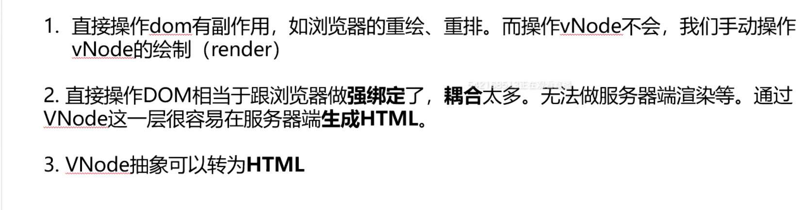

### 前端面试准备

[TOC]

### HTML

### CSS

#### 盒子模型

又叫盒模型，分为标准盒子模型、低版本IE盒子模型

标准盒子模型包括四个部分：宽度 = margin + border + padding + 内容宽度（content）

低版本IE盒子模型包括：宽度 = 内容宽度（content+border+padding）+ margin

#### CSS选择器

通配符选择器 *

id选择器

类选择器

标签选择器

相邻选择器

自选择器

后代选择器

属性选择器

伪类选择器

##### 权重计算

important > 内联样式 > id > class | 伪类 | 属性 > 标签 | 伪元素 > 继承 > 通配符

Infinity		1000		100						10		    1		0


##### CSS3新增伪类

p:first-of-type 	选择属于其父元素的首个元素

p:last-of-type 	选择属于其父元素的最后元素

p:only-of-type 	选择属于其父元素唯一的元素

p:only-child 		选择属于其父元素的唯一子元素

p:nth-child(2) 	选择属于其父元素的第二个子元素

:enabled :disabled 表单控件的禁用状态

:checked 	单选框或复选框被选中

#### 居中

##### 垂直居中

```css
/* 绝对定位 + 块级元素定高 + 计算高度的一般 */
#position_ele {
    position: absolute;
    width: 100px;
    height: 100px;
    top: 50%;
    left: 0;
    margin-top: -50px;
}

/* flex 布局 + 块级元素定高 + align-items 属性 */
#flex_ele {
    display: flex;
    height: 200px;
    align-items: center;
}
```

##### 水平居中

```css
/* flex 布局 + 定宽 + margin auto */
#flex_ele {
  display: flex;
  justify-content: center;
  align-items: center;
  background-color: #ff0;
  width: 100px;
  margin: 50px auto;
}

/* 绝对定位 + 块级元素定宽高 + 计算宽度的一半 */
#position_ele {
    position: absolute;
    width: 100px;
    height: 100px;
    top: 0;
    left: 50%;
    margin-top: -50px;
}

/* 绝对定位 + 块级元素定宽高 + margin auto */
#position_ele1 {
  border: 1px solid black;
  position: absolute;
  width: 200px;
  height: 100px;
  margin: 0 auto;
  left: 0;
  right: 0;
}
```

##### 水平垂直居中

```css
/* flex 布局 + align-items 属性 + justify-content 属性 */
#flex_ele {
    display: flex;
    align-items: center;
    justify-content: center;
}

/* 绝对定位 + 块级元素定高定宽 + 计算高度/宽度的一般 */
#position_ele {
  border: 1px solid green;
  position: absolute;
  top: 50%;
  left: 50%;
  width: 100px;
  height: 100px;
  margin: -50px 0 0 -50px;
}

/* 浮动元素 */
#float_ele {
  border: 1px solid red;
  float: left;
  position: absolute;
  width: 200px;
  height: 100px;
  left: 50%;
  top: 50%;
  margin: -50px 0 0 -100px;
}


```


浮动元素

#### 布局

##### Flex 布局

##### Grid 布局

##### columns 多列布局

#### dispaly

#### position

#### CSS3 新特性

#### CSS 创建一个三角形

#### 品字布局

#### 兼容性问题

#### link 和 @import 区别

#### CSS reset

#### CSS 样式初始化

#### absolute的containing block计算方式跟正常流有什么不同？

#### CSS里的visibility属性有个collapse属性值，在不同浏览器下以后有什么区别？

#### display：none 与 visibility：hidden的区别

#### position跟display、overflow、float这些特性相互叠加后会怎么样？

#### 对BFC规范（块级格式化上下文：block formatting context）的理解？

#### 为什么会出现浮动？什么时候清除浮动？清除浮动的方式？

#### 上下margin重合问题

#### 清除元素浮动后，该元素的display值是 多少？

#### 移动端的布局用过媒体查询吗？

#### 使用CSS预处理器

#### CSS 优化、提高性能的方法

#### 浏览器是怎样解析CSS选择器的？

#### 全屏滚动的原理？用到了CSS哪些属性？

#### 什么是响应式设计？响应式设计的基本原理是什么？如何兼容低版本的IE？

#### 视差滚动效果（Parallax Scrolling）

#### ::before 和 ::after中 双冒号和单冒号有什么区别？解释伪元素作用

#### line-height如何理解的？

#### chrome支持小于12px的字体

#### 让页面里的字体变清晰，变细用CSS怎么做？

#### position:fixed;在android下无效怎么处理？

#### 如果需要手动写动画，你认为最小时间间隔是多久，为什么？


### JavaScript

#### 介绍一下作用域与作用域链

在JavaScript中有执行环境，执行环境定义了变量和函数，执行环境包括全局执行环境和函数执行环境。

#### 全局执行环境

最外围的一个执行环境，在web浏览器中，我们可以认为他是window对象，在nodejs中，global对象。代码载入浏览器时，全局环境被创建，关闭网页或者关闭浏览器时全局变量被销毁。

#### 函数执行环境

每个函数都有自己的执行环境，当执行流进入一个函数时，函数的环境就被推入一个环境栈中，当函数执行完毕后，栈将其环境弹出，把控制权返回给之前的执行环境。

#### 全局作用域 globe scope

在全局执行环境中定义的变量具有全局作用域，window对象的内置属性都拥有全局作用域

在函数中定义变量省略var时，那么变量就变为全局变量，拥有全局作用域，不推荐

#### 局部作用域 local scope

在函数内部定义的变量只有在本函数内部才可以访问得到

#### 作用域链 scope chian

全局作用域和局部作用域中变量的访问权限，其实是由作用域链决定的。

每次进入一个新的执行环境，都会创建一个用于搜索变量和函数的作用域链。

**作用域链是函数被创建的作用域中对象的集合。**

作用域链可以保证对执行环境有权访问的所有变量和函数的有序访问。

作用域链的最前端始终是当前执行的代码所在环境的变量对象，下一变量对象来自包含环境，下一变量对象来自包含环境的包含环境，依次往上，直到全局执行环境的变量对象。全局执行环境的变量对象始终是作用域链的最后一个对象。

标识符解析是沿着作用域一级一级的向上搜索标识符的过程。搜索过程始终是从作用域的前端逐地向后回溯，直到找到标识符，找不到会报错。

#### 提升 hoisting

#### 变量提升 variable hoisting

把变量声明提升到函数的顶部，不会把赋值也提升

#### 函数提升 

```javascript
function () {
    func();
	function func(){
		console.log("可以被提升");
	}
}
```


### 原型链

#### 创建对象

#### 创建对象的方法

```javascript
// 字面量
var o1 = {name: 'o1'}
var o2 = new Object({name: 'o2'})

// 构造函数
var M = function(name) {this.name = name;}
var o3 = new M('o3')

// Object.create
var p = {name : 'p'}
var o4 = Object.create(p)


```


#### 原形、构造函数、实例、原型链

##### 什么是原型链？

**原型链就是原型组成的链**，对象的`__proto__`是它的原型，而原型也是一个对象，也有`__proto__`属性，循环往复，当找到Object的原型时，这条原型链就结束了

原型对象和实例之间有什么作用？

通过一个构造函数创建出来的多个实例，如果都要添加一个方法，给每个实例去添加并不是一个明智的选择，这时候就该用上原型了。

在实例的原型上添加一个方法，这个原型的所有实例便都有了这个方法。

JS引擎分析方式中，在访问一个实例的属性时，先在实例的本身中找，如果没找到就去它的原型中找，还没找到就再往上找，直到找到。这就是原型链。

PS：

1. 只有函数有prototype属性，对象是没有的
2. 但是函数也有`__proto__`属性，因为函数也是对象，函数的`__proto__`指向的是Function.prototype，也就是说普通函数是Function这个构造函数的一个实例。

##### instanceof原理

instanceof是判断实例对象的`__proto__`和生成该实例的构造函数的`prototype`是不是引用的同一个地址

PS：

实例的instanceof在比较的时候，与原型上向上找的构造函数相比都是true

使用constructor判断实例是由哪个构造函数生成的

如：`obj.__proto__.constructor`

##### new运算符


### ES6

#### 十大特性

1. #### Default Parameters 默认参数

   ```
   var link = function(height = 50, color = 'red', url = 'http://azat.co') {  
     ...  
   }
   ```

2. #### Template Literals 模版对象

   ```
   var name = 'Your name is ${first} ${last}.';
   var url = 'http://loalhost:3000/api/messages/${id}';
   ```

3. #### Multi-line Strings 多行字符串

   ```
   var roadPoem = `Then took the other, as just as fair, 
       And having perhaps the better claim 
       Because it was grassy and wanted wear  
       Though as for that the passing theren 
       Had worn them really about the same,`;  
   var fourAgreements = `You have the right to be you.n  
       You can only be you when you do your best.`; 
   ```

4. #### Destructuring Assignment 解构赋值

   ```
   var {house,mouse} = $('body').data(); //we'll get house and mouse variables 
   var {jsonMiddleware} = require('body-parser');
   var {username,password} = req.body;
   
   var [col1,col2] = $('.column'),
       [line1,line2,line3, ,line5] = file.split('n');
   ```

5. #### Enhanced Object Literals 增强的对象字面量

   ```
   var serviceBase = {port: 3000, url: 'azat.co'},
   getAccount = function(){return [1,2,3]};
   var accountService = {
       __proto__: serviceBase, //通过proto设置属性
       getAccount, // 既可以直接分配getAccounts: getAccounts,也可以只需用一个getAccounts
       toString() { //这里将json形式改为函数形式 
           return JSON.stringify(super.valueOf()); 
           //调用super防范
       },  
       getUrl() {return "http://" + this.url + ':' + this.port},  
       [ 'valueOf_' + getAccounts().join('_') ]: getAccounts()  //使用动态key值(valueOf_1_2_3)此处将getAccounts()方法得到的数组[1,2,3]转化为字符串1_2_3
   };
   console.log(accountService);
   ```

6. #### Arrow Functions in 箭头函数

   ```
   // this的指向，根据所在上下文而定,this还是原来的this
   var logUpperCase = function() {  
     this.string = this.string.toUpperCase();//this还是原来的this  
     return () => console.log(this.string);  
   }  
   logUpperCase.call({ string: 'ES6 rocks' })();
   
   // 简单函数
   var single = a => a;
   single('hello,world');
   
   // 箭头函数不会创建自己的this,它只会从自己的作用域链的上一层继承this
   
   // 由于 箭头函数没有自己的this指针，通过 call() 或 apply() 方法调用一个函数时，只能传递参数（不能绑定this---译者注），他们的第一个参数会被忽略。（这种现象对于bind方法同样成立---译者注
   ```

7. #### Promise

   ```
   // 可以用promise重写
   
   var wait1000 = ()=> new Promise((resolve,reject)=>{ setTimeout(resolve,1000);});
   wait1000()
       .then(function(){
           console.log('Yay!');  
           return wait1000()
       })
       .then(function(){
            console.log('Wheeyee!');  
       });
   ```

8. #### Block-Scoped 块级作用域和构造let和const

   ```
   // 块级作用域
   // 允许你把变量作用域控制在块级里面
   // 我们用let限制块级作用域。而var是限制函数作用域。
   ```

9. #### Classes(类)

   ```
   // ES6没有用函数,而是使用原型实现类
   class baseModel {  
       constructor(options, data) {// class constructor， 注意我们对options 和data使用了默认参数值。
           this.name = 'Base';  
           this.url = 'http://azat.co/api';  
           this.data = data;  
           this.options = options;  
      }  
       getName() { // class method  
           console.log(`Class name: ${this.name}`);  
       } 
       getUrl() { // class method  
            console.log(`Url: ${this.url}`);  
       }
   }
   
   // AccountModel 从类baseModel 中继承而来
   class AccountModel extends baseModel {  
       constructor(options, data) { 
           super({private: true}, ['32', '5242']); 
           this.url +='/accounts/';  
       }
       get accountsData() {
           return this.data;  
       }  
   } 
   // 调用
   let accounts = new AccountModel(5);  
   accounts.getName();  // Class name:  Base
   console.log('Data is %s', accounts.accountsData); 
   // Data is 32,5242 
   
   //子类必须在constructor方法中调用super方法，否则新建实例时会报错。
   //这是因为子类没有自己的this对象，而是继承父类的this对象，然后对其进行加工。
   //如果不调用super方法，子类就得不到this对象。
   ```

10. #### model

    ```
    // 导出方法
    export var port = 3000;
    export function getAccounts(url) { ...}
    
    // 导入方法
    import {port, getAccounts} from 'module';
    console.log(port); // 300
                                      
    // 整体导入
    import * as service from 'module';
    console.log(service.port); // 3000
    ```

11. #### 其他特性

    1. ##### 全新的Math, Number, String, Array 和 Object 方法

    2. ##### 二进制和八进制数据类型

    3. ##### 默认参数不定参数扩展运算符

    4. ##### Symbols符号

    5. ##### tail调用

    6. ##### Generators (生成器)

    7. ##### New data structures like Map and Set(新的数据构造对像MAP和set)

### ES7/8新特性

#### ES7 特性

1. `Array.prototype.includes`
2. Exponentiation Operator(求幂运算)

#### ES8特性

1. ###### Object.values / Object.entries

   ```
   let obj = {a: 1, b: 2, c: 3}
   Object.values(obj).forEach(value=>console.log(value)) // 1, 2, 3
   
   JSON.stringify(Object.entries(obj))
   // "[["a",1],["b",2],["c",3]]"
   
   Object.entries(obj).forEach(([key, value]) => {
    console.log(`${key} is ${value}`)
   })
   // a is 1, b is 2, c is 3
   ```

2. ###### String padding 字符串填充

   ```
   console.log('react'.padStart(10).length)         // "       react" is 10
   console.log('backbone'.padStart(10).length)         // "  backbone" is 10
   
   console.log('react'.padStart(10, '_'))         // "_____react"
   console.log('backbone'.padStart(10, '*'))         // "**backbone"
   
   //padEnd
   padEnd顾名思义就是从字符串的尾端右边开始填充。第二个参数，你能实际上用一个任何长度的字符串
   ```

3. ###### Object.getOwnPropertyDescriptors

4. ###### 函数参数列表和调用中的尾逗号（Trailing commas）

5. ###### 异步函数（Async Functions）

### Virtual DOM 和 真实DOM的区别



144.34.204.217