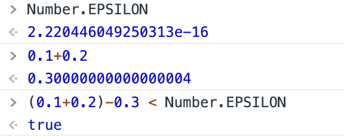
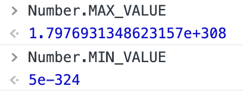

# JavaScript高级程序设计

[TOC]

## 第一章 JavaScript简介

### 1.1 JavaScript简史

### 1.2 JavaScript实现

- 1.2.1 ECMAScript

- 1.2.2 文档对象模型（DOM）

- 1.2.3 浏览器对象模型（BOM）

### 1.3 JavaScript版本

### 1.4 小结

## 第二章 在HTML中使用JavaScript

### 2.1 \<script\>元素

- 2.1.1 标签的位置

- 2.1.2 延迟脚本

- 2.1.3 异步脚本

- 2.1.4 在XHTML中的用法

- 2.1.5 不推荐使用的语法

### 2.2 嵌入代码与外部文件

### 2.3 文档模式

### 2.4 \<noscript\>元素

### 2.5 小结

## 第三章

### 3.1 语法

- 3.1.1 区分大小写

- 3.1.2 标识符

- 3.1.3 注释

- 3.1.4 严格模式

- 3.1.5 语句

### 3.2 关键字和保留字

### 3.3 变量

### 3.4 数据类型

- 3.4.1 typeof 操作符

- 3.4.2 Undefined 类型

- 3.4.3 Null 类型

- 3.4.4 Boolean 类型

- 3.4.5 Number 类型

- 3.4.6 String 类型

- 3.4.7 Object 类型

### 3.5 操作符

- 3.5.1 一元操作符

- 3.5.2 位操作符

- 3.5.3 布尔操作符

- 3.5.4 乘性操作符

- 3.5.5 加性操作符

- 3.5.6 关系操作符

- 3.5.7 相等操作符

- 3.5.8 条件操作符

- 3.5.9 赋值操作符

- 3.5.10 逗号操作符

### 3.6 语句

- 3.6.1 if 语句

- 3.6.2 do-while 语句

- 3.6.3 while 语句

- 3.6.4 for 语句

- 3.6.5 for-in 语句

- 3.6.6 label 语句

- 3.6.7 break 和 continue 语句

- 3.6.8 with 语句

- 3.6.9 switch 语句

### 3.7 函数

- 3.7.1 理解参数

- 3.7.2 没有重载

### 3.8 小结

## 第四章 变量、作用域和内存问题

### 4.1 基本类型和引用类型的值

- 4.1.1 动态的属性

- 4.1.2 复制变量值

- 4.1.3 传递参数

- 4.1.4 检测类型

### 4.2 执行环境及作用域

- 4.2.1 延长作用域

- 4.2.2 没有块级作用域

### 4.3 垃圾收集

- 4.3.1 标记清除

- 4.3.2 引用计数

- 4.3.3 性能问题

- 4.3.4 管理内存

### 4.4 小结

## 第五章 引用类型

### 5.1 Object 类型

### 5.2 Array 类型

- 5.2.1 检测数组

- 5.2.2 转换方法

- 5.2.3 栈方法

- 5.2.4 队列方法

- 5.2.5 重排序方法

- 5.2.6 操作方法

- 5.2.7 位置方法

- 5.2.8 迭代方法

- 5.2.9 归并方法

### 5.3 Date 类型

- 5.3.1 继承的方法

- 5.3.2 日期格式化方法

- 5.3.3 作为值的函数

### 5.4 RegExp 类型

- 5.4.1 RegExp 实例属性

- 5.4.2 RegExp 实例方法

- 5.4.3 RegExp 构造函数属性

- 5.4.4 模式的局限性

### 5.5 Function 类型

- 5.5.1 没有重载（深入理解）

- 5.5.2 函数声明与函数表达式

- 5.5.3 作为值的函数

- 5.5.4 函数内部属性

- 5.5.5 函数属性和方法

### 5.6 基本包装类型

- 5.6.1 Boolean 类型

- 5.6.2 Number 类型

- 5.6.3 String 类型

### 5.7 单体内置对象

- 5.7.1 Global 对象

- 5.7.2 Math 对象

### 5.8 小结

## 第六章 面向对象的程序设计

### 6.1 理解对象

- 6.1.1 属性类型

- 6.1.2 定义多个属性

- 6.1.3 读取属性的特性

### 6.2 创建对象

- 6.2.1 工厂模式

- 6.2.2 构造函数模式

- 6.2.3 原型模式

- 6.2.4 组合使用构造函数模式和原型模式

- 6.2.5 动态原型模式

- 6.2.6 寄生构造函数模式

- 6.2.7 稳妥构造函数模式

### 6.3 继承

- 6.3.1 原型链

- 6.3.2 借用的构造函数

- 6.3.3 组合继承

- 6.3.4 原型式继承

- 6.3.5 寄生式继承

- 6.3.6 寄生组合式继承

### 6.4 小结

## 第七章 函数表达式

### 7.1 递归

### 7.2 闭包

- 7.2.1 闭包与变量

- 7.2.2 关于this对象

- 7.2.3 内存泄漏

### 7.3 模仿块级作用域

### 7.4 私有变量

- 7.4.1 静态私有变量

- 7.4.2 模块模式

- 7.4.3 增强的模块模式

### 7.5 小结

## 第八章 BOM

### 8.1 window 对象

- 8.1.1 全局作用域

- 8.1.2 窗口关系及框架

- 8.1.3 窗口位置

- 8.1.4 窗口大小

- 8.1.5 导航和打开窗口

- 8.1.6 间歇调用和超时调用

- 8.1.7 系统对话框

### 8.2 location 对象

- 8.2.1 查询字符串参数

- 8.2.2 位置操作

### 8.3 navigator 对象

- 8.3.1 检测插件

- 8.3.2 注册处理程序

### 8.4 screen 对象

### 8.5 history 对象

### 8.6 小结

## 第九章 客户端检测

### 9.1 能力检测

- 9.1.1 更可靠的能力检测

- 9.1.2 能力检测，不是浏览器检测

### 9.2 怪癖检测

### 9.3 用户代理检测

- 9.3.1 用户代理字符串的历史

- 9.3.2 用户代理字符串检测技术

- 9.3.3 完整的代码

- 9.3.4 使用方法

### 9.4 小结

## 第十章 DOM

### 10.1 节点层次

- 10.1.1 Node 类型

- 10.1.2 Document 类型

- 10.1.3 Element 类型

- 10.1.4 Text 类型

- 10.1.5 Comment 类型

- 10.1.6 CDATASection 类型

- 10.1.7 DocumentType 类型

- 10.1.8 DocumentFragment 类型

- 10.1.9 Attr 类型

### 10.2 DOM 操作技术

- 10.2.1 动态脚本

- 10.2.2 动态样式

- 10.2.3 操作表格

- 10.2.4 使用 NodeList

### 10.3 小结

## 第十一章 DOM 扩展

### 11.1 选择符 API

- 11.1.1 querySelector() 方法

- 11.1.2 querySelectorAll() 方法

- 11.1.3 matchesSelector() 方法

### 11.2 元素遍历

### 11.3 HTML5

- 11.3.1 与类相关的扩充

- 11.3.2 焦点管理

- 11.3.3 HTMLDocument 的变化

- 11.3.4 字符集属性

- 11.3.5 自定义数据属性

- 11.3.6 插入标记

- 11.3.7 scrollIntoView() 方法

### 11.4 专有扩展

- 11.4.1 文档模式

- 11.4.2 children 属性

- 11.4.3 contains() 方法

- 11.4.4 插入文本

- 11.4.5 滚动

### 11.5 小结

## 第十二章 DOM2 和 DOM3

### 12.1 DOM变化

- 12.1.1 针对XML命名空间的变化

- 12.1.2 其他方面的变化

### 12.2 样式

- 12.2.1 访问元素的样式

- 12.2.2 操作样式表

- 12.2.3 元素大小

### 12.3 遍历

- 12.3.1 NodeIterator

- 12.3.2 TreeWalker

### 12.4 范围

- 12.4.1 DOM 中的范围

- 12.4.2 IE8 及更早版本中的范围

### 12.5 小结

## 第十三章 事件

### 13.1 事件流

- 13.1.1 事件冒泡

- 13.1.2 事件捕获

- 13.1.3 DOM 事件流

### 13.2 事件处理程序

- 13.2.1 HTML 事件处理程序

- 13.2.2 DOM0 级事件处理程序

- 13.2.3 DOM2 级事件处理程序

- 13.2.4 IE 事件处理程序

- 13.2.5 跨浏览器的事件处理程序

### 13.3 事件对象

- 13.3.1 DOM 中的事件对象

- 13.3.2 IE 中的事件对象

- 13.3.3 跨浏览器的事件对象

### 13.4 事件类型

- 13.4.1 UI 事件

- 13.4.2 焦点事件

- 13.4.3 鼠标与滚轮事件

- 13.4.4 键盘与文本事件

- 13.4.5 复合事件

- 13.4.6 变动事件

- 13.4.7 HTML5 事件

- 13.4.8 设备事件

- 13.4.9 触摸与手势事件

### 13.5 内存和性能

- 13.5.1 事件委托

- 13.5.2 移除事件处理程序

### 13.6 模拟事件

- 13.6.1 DOM 中的事件模拟

- 13.6.2 IE 中的事件模拟

### 13.7 小结

## 第十四章 表单脚本

### 14.1 表单的基础知识

- 14.1.1 提交表单

- 14.1.2 重置表单

- 14.1.3 表单字段

### 14.2 文本框脚本

- 14.2.1 选择文本

- 14.2.2 过滤输入

- 14.2.3 自动切换焦点

- 14.2.4 HTML5 约束验证API

### 14.3 选择框脚本

- 14.3.1 选择选项

- 14.3.2 添加选项

- 14.3.3 移除选项

- 14.3.4 移动和重排选项

### 14.4 表单序列化

### 14.5 富文本编辑

- 14.5.1 使用 contenteditable 属性

- 14.5.2 操作符文本

- 14.5.3 符文本选区

- 14.5.4 表单与富文本

### 14.6 小结

## 第十五章 使用 Canvas 绘图

### 15.1 基本用法

### 15.2 2D上下文

- 15.2.1 填充和描边

- 15.2.2 绘制矩形

- 15.2.3 绘制路径

- 15.2.4 绘制文本

- 15.2.5 变换

- 15.2.6 绘制图像

- 15.2.7 阴影

- 15.2.8 渐变

- 15.2.9 模式

- 15.2.10 使用图像数据

- 15.2.11 合成

### 15.3 WebGL

- 15.3.1 类型化数组

- 15.3.2 WebGL上下文

- 15.3.3 支持

### 15.4 小结

## 第十六章 HTML5 脚本编程

### 16.1 跨文档消息传送

### 16.2 原生拖放

- 16.2.1 拖放事件

- 16.2.2 自定义放置目标

- 16.2.3 dataTransfer 对象

- 16.2.4 dropEffect 与 effectAllowed

- 16.2.5 可拖动

- 16.2.6 其他成员

### 16.3 媒体元素

- 16.3.1 属性

- 16.3.2 事件

- 16.3.3 自定义媒体播放器

- 16.3.4 检测编解码器的支持情况

- 16.3.5 Audio 类型

### 16.4 历史状态管理

### 16.5 小结

## 第十七章 错误处理与调试

### 17.1 浏览器报告的错误

- 17.1.1 IE

- 17.1.2 Firefox

- 17.1.3 Safari

- 17.1.4 Opera

- 17.1.5 Chrome

### 17.2 错误处理

- 17.2.1 try-catch 语句

- 17.2.2 抛出错误

- 17.2.3 错误事件

- 17.2.4 处理错误的策略

- 17.2.5 常见的错误类型

- 17.2.6 区分致命错误和非致命错误

- 17.2.7 把错误记录到服务器

### 17.3 调试技术

- 17.3.1 将消息记录到控制台

- 17.3.2 将消息记录到当前页面

- 17.3.3 抛出错误

### 17.4 常见的IE错误

- 17.4.1 操作终止

- 17.4.2 无效字符

- 17.4.3 未找到成员

- 17.4.4 未知运行时错误

- 17.4.5 语法错误

- 17.4.6 系统无法找到指定资源

### 17.5 小结

## 第十八章 JavaScript 与 XML

### 18.1 浏览器对 XML DOM 的支持

- 18.1.1 DOM2 级核心

- 18.1.2 DOMParser 类型

- 18.1.3 XMLSerializer 类型

- 18.1.4 IE8 及之前版本中的 XML

- 18.1.5 跨浏览器处理 XML

### 18.2 浏览器对XPath的支持

- 18.2.1 DOM3 级 XPath

- 18.2.2 IE 中的 XPath

- 18.2.3 跨浏览器使用XPath

### 18.3 浏览器对XSLT的支持

- 18.3.1 IE 中的 XSLT

- 18.3.2 XSLTProcessor 类型

- 18.3.3 跨浏览器使用XSLT

### 18.4 小结

## 第十九章 E4X

### 19.1 E4X的类型

- 19.1.1 XML 类型

- 19.1.2 XMLList 类型

- 19.1.3 Namespace 类型

- 19.1.4 QName 类型

### 19.2 一般用法

- 19.2.1 访问特性

- 19.2.2 其他节点类型

- 19.2.3 查询

- 19.2.4 构建和操作 XML

- 19.2.5 解析和序列化

- 19.2.6 命名空间

### 19.3 其他变化

### 19.4 全面启用 E4X

### 19.5 小结

## 第二十章 JSON

### 20.1 语法

- 20.1.1 简单值

- 20.1.2 对象

- 20.1.3 数组

### 20.2 解析与序列化

- 20.2.1 JSON 对象

- 20.2.2 序列化选项

- 20.2.3 解析选项

### 20.3 小结

## 第二十一章 Ajax 与 Comet

### 21.1 XMLHttpRequest 对象

- 21.1.1 XHR 的用法

- 21.1.2 HTTP 头部信息

- 21.1.3 GET 请求

- 21.1.4 POST 请求

### 21.2 XMLHttpRequest 2级

- 21.2.1 FormData

- 21.2.2 超时设定

- 21.2.3 overrideMimeType() 方法

### 21.3 进度事件

- 21.3.1 load 事件
- 21.3.2 progress 事件

### 21.4 跨源资源共享

- 21.4.1 IE 对 CORS 的实现

- 21.4.2 其他浏览器对 CORS 的实现

- 21.4.3 Preflighted Requests

- 21.4.4 带凭据的请求

- 21.4.5 跨浏览器的CORS

### 21.5 其他跨域技术

- 21.5.1 图像 Ping

- 21.5.2 JSONP

- 21.5.3 Comet

- 21.5.4 服务器发送事件

- 21.5.5 Web Sockets

- 21.5.6 SSE 与 Web Sockets

### 21.6 安全

### 21.7 小结

## 第二十二章 高级技巧

### 22.1 高级函数

- 22.1.1 安全的类型检测

- 22.1.2 作用域安全的构造函数

- 22.1.3 惰性载入函数

- 22.1.4 函数绑定

- 22.1.5 函数柯里化

### 22.2 防篡改对象

- 22.2.1 不可扩展对象

- 22.2.2 密封的对象

- 22.2.3 冻结的对象

### 22.3 高级定时器

- 22.3.1 重复的定时器

- 22.3.2 Yielding Processes

- 22.3.3 函数节流

### 22.4 自定义事件

### 22.5 拖放

- 22.5.1 修缮拖动功能

- 22.5.2 添加自定义事件

### 22.6 小结

## 第二十三章 离线应用与客户端存储

### 23.1 离线检测

### 23.2 应用缓存

### 23.3 数据存储

- 23.3.1 Cookie

- 23.3.2 IE 用户数据

- 23.3.3 Web 存储机制

- 23.3.4 IndexedDB

### 23.4 小结

## 第二十四章 最佳实践

### 24.1 可维护性

- 24.1.1 什么是可维护的代码

- 24.1.2 代码约定

- 24.1.3 松散耦合

- 24.1.4 编程实战

### 24.2 性能

- 24.2.1 注意作用域

- 24.2.2 选择正确方法

- 24.2.3 最小化语句数

- 24.2.4 优化 DOM 交互

### 24.3 部署

- 24.3.1 构建过程

- 24.3.2 验证

- 24.3.3 压缩

### 24.4 小结

## 第二十五章 新型的 API

### 25.1 requestAnimationFrame()

- 25.1.1 早期动画循环	

- 25.1.2 循环间隔的问题

- 25.1.3 mozRequestAnimationFrame

- 25.1.4 webkitRequestAnimationFrame 与 msRequestAnimationFrame

### 25.2 Page Visibility API

### 25.3 Geolocation API

### 25.4 File API

- 25.4.1 FileReader 类型

- 25.4.2 读取部分内容

- 25.4.3 对象URL

- 25.4.4 读取拖放的文件

- 25.4.5 使用 XHR 上传文件

### 25.5 Web 计时

### 25.6 Web Workers

- 25.6.1 使用 Worker

- 25.6.2 Worker 全局作用域

- 25.6.3 包含其他脚本

- 25.6.4 Web Workers 的未来

### 25.7 小结

## 附录 A ECMAScript Harmony

## 附录 B 严格模式

## 附录 C JavaScript 库

## 附录 D JavaScript 工具

## 阅读

### 第一章 JavaScript简介

诞生：1995

背景：处理当时由服务器负责的一些输入验证操作

JS之父：Brendan Eich（布兰登·艾奇）

JS实现：

1. 核心（ECMAScript）
2. 文档对象模型
3. 浏览器对象模型

DOM

为什么要用？

Netscape和微软各自开发自己的DHTML，IE4和Netscape Navigator 4浏览器互不兼容，负责制定Web通信标准的W3C开始着手规划DOM

DOM级别

DOM 1级：

- DOM核心[规定如何映射基于XML的文档结构]
- DOM HTML[添加了针对HTML的对象和方法]

DOM 2级：

- DOM 视图[定义了跟踪不同文档视图的接口]
- DOM 事件[定义了事件和事件处理的接口]
- DOM 样式[定义了基于CSS为元素应用样式的接口]
- DOM 遍历和范围[定义了遍历和操作文档树的接口]

DOM 3级：

- DOM 加载和保存
- DOM 验证
- 扩展DOM核心，支持XML1.0

其他DOM标准

- SVG
- MathML
- SMIL

Web浏览器对DOM的支持

主流浏览器每次发布新版本都会改进对DOM的支持

浏览器对象模型（BOM）

IE3 和 Nescape Navigator 3 有一个共同的特色，就是支持可以访问和操作浏览器窗口的浏览器对象模型（BOM，Browser Object Model）

HTML5 致力于把很多BOM功能写入正是规范。

从根本上讲，BOM只处理浏览器窗口和框架

扩展：

- 弹出新浏览器窗口的功能
- 移动、缩放和关闭浏览器窗口的功能
- 提供浏览器想信息的navigator对象
- 提供浏览器所加载页面的详细信息的location对象
- 提供用户显示器分辨率详细信息的screen对象
- 对cookies的支持
- 像XMLHttpRequest和IE的ActiveXObject这样的自定义对象

小结

JavaScript是一种专为网页交互而设计的脚本语言

- ECMAScript，有ECMA-262定义，提供核心语言功能
- 文档对象模型 DOM，提供访问和操作网页内容的方法和接口
- 浏览器对象模型 BOM，提供与浏览器交互的方法和接口

主要浏览器：IE 、FIrefox、Chrome、Safari、Opera

### 第二章 在HTML中使用JavaScript

- 使用\<script\>元素
- 嵌入脚本与外部脚本
- 文档模式对JavaScript的影响
- 考虑禁用JavaScript的场景

使用\<script\>元素

6个属性

- async：可选。立即下载，异步执行
- charset：可选，通过src属性置顶的代码的字符集
- defer：可选，延迟至文档完全加载后执行，只对外部脚本文件有效
- language：废弃
- src：可选，可执行代码外部文件
- type：可选，表示编写代码使用的脚本语言的内容类型（MIME类型）

### 第三章 基本概念

- 语法
- 数据类型
- 流控制语句
- 函数

语法

区分大小写

标识符

- 第一个字符必须是字母、下划线或美元符号
- 其他字符可以是同类型及数字

注释

严格模式

​	`use strict`

语句

分号`;`, 代码段中建议使用`{}`

关键字和标瘤子

变量

ECMAScript的变量时松散类型的，松散类型指的就是可以保存任何类型的数据。

let、const、var区别：作用域

数据类型

- Undefined
- Null
- Boolean
- Object
- Number
- String
- Symbol

typeof 操作符 判断数据类型，返回字符串

- "undefined" —— 声明未定义
- "boolean" —— 布尔值
- "string" —— 字符串
- "number" —— 数值
- "object" —— 对象或者null
- “function“ —— 函数

Number类型

+0 和 -0 

float 浮点数值

浮点数的最高精度为17位，可以使用Number.EPSILON做精度判断，符合精度的都可认为相等，如下经典案例：0.1+0.2 与 0.3

浮点数值计算会产生舍入误差问题，有一点需要明确，这是机遇IEEE754数值的浮点计算的通病

数值范围，由于内存限制，ECMAScript并不能保存世界上所有的数值。

最小值：Number.MIN_VALUE

最大值：Number.MAX_VALUE

NaN（Not a Number）

非数值，表示不等于任何数值的Nember类型，包括它本身

isNaN()函数

表示非数值，都会返回true

isNaN函数会先进行类型转换

数值转换

有3个函数可以把非数值转换为数值：Number()、parseInt()、parseFloat()

undefined会返回NaN

一元加操作符与Number()函数相同

