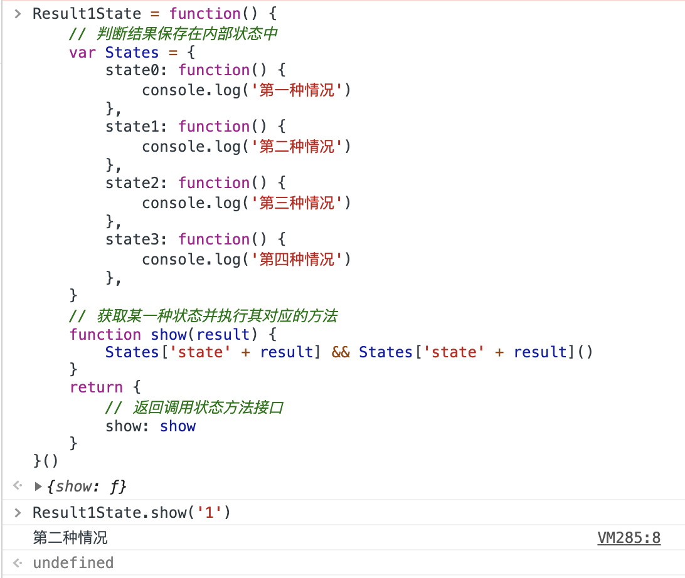
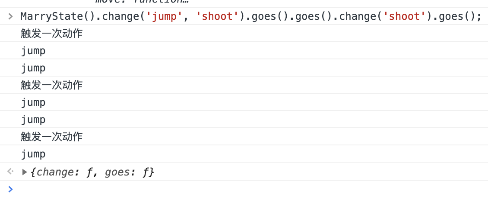
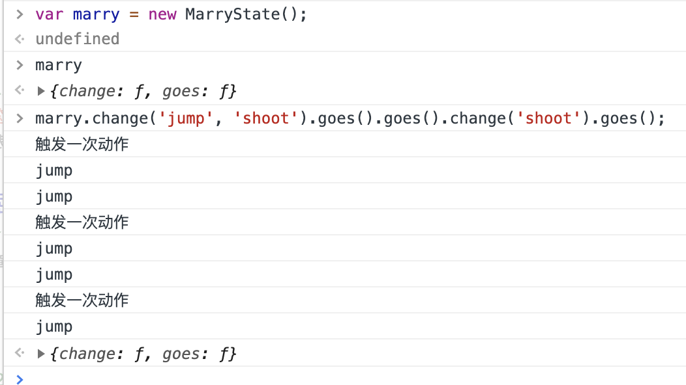

## 读书笔记——《JavaScript设计模式》 

@Author: 张容铭

@Reader: DAN

| 时间       | Page(start_end) | Content        |
| :--------- | --------------- | -------------- |
| 2018/08/15 | 0——6            | 前言           |
| 2018/08/16 | 7——14           | 第一章、第二章 |
| 2018/08/20 | 14——15          | 第二章、       |
| 2018/08/21 | 15——15          | 第二章         |
| 2018/08/24 | 15——19          | 第二章         |
| 2018/11/07 | 19——21          | 第二章         |
|            |                 |                |
|            |                 |                |

[TOC]

### 前言

创作背景：模式解决问题，避免编写难懂而且臃肿的代码，提高开发效率和工作效率，积攒模式

第一读者：有部分JavaScript基础并想深入学习JavaScript，成为一名标准Web开发人员或前端工程师。想深入了解面向对象编程思想，提高自己模块化开发能力，写出可维护、高效率、可拓展的代码的程序员。

第二读者：转行前端的Java/C++程序员。

第三读者：对设计模式感兴趣的研发人员。

第四读者：前端开发专业人员。

本书内容：

- 第一篇
  - 第一章 JavaScript基础
  - 第二章 面向对象编程
- 第二篇
  - 第三章 简单工厂模式
  - 第四章 工厂方法模式
  - 第五章 抽象工厂模式
  - 第六章 建造者模式
  - 第七章 原型模式
  - 第八章 单例模式
- 第三篇
  - 第九章 外观模式
  - 第十章 适配器模式
  - 第十一章 代理模式
  - 第十二章 装饰者模式
  - 第十三章 桥接模式
  - 第十四章 组合模式
  - 第十五章 享元模式
- 第四篇
  - 第十六章 模版方法模式
  - 第十七章 观察者模式
  - 第十八章 状态模式
  - 第十九章 策略模式
  - 第二十章 职责链模式
  - 第二十一章 命令模式
  - 第二十二章 访问者模式
  - 第二十三章 中介者模式
  - 第二十四章 备忘录模式
  - 第二十五章 迭代器模式
  - 第二十六章 解释器模式
- 第五篇
  - 第二十七章 链模式
  - 第二十八章 委托模式
  - 第二十九章 数据访问对象模式
  - 第三十章 节流模式
  - 第三十一章 简单模版模式
  - 第三十二章 惰性模式
  - 第三十三章 参与者模式
  - 第三十四章 等待者模式
- 第六篇
  - 第三十五章 同步模块模式
  - 第三十六章 异步模块模式
  - 第三十七章 Widget模式
  - 第三十八章 MVC模式
  - 第三十九章 MVP模式
  - 第四十章 MVVM模式

### 第一篇 面向对象编程

*面向对象编程[Object-oriented programming，OOP]是一种程序设计范型。它将对象作为程序的基本单元，将程序和数据封装其中，以提高程序的重用性、灵活性和扩展性*

#### 第 1 章 灵活的语言——JavaScript

##### 1.1 入职第一天

编写了三个函数

```javascript
function checkName () {
    // 验证姓名
}
function checkEmail () {
    // 验证邮箱
}
function checkPassword () {
    // 验证密码
}
...
```

提交时被同事拦住，函数是变量嘛？

##### 1.2 函数的另一种形式

```javascript
var checkName = function () {
    // 验证姓名
}
var checkEmail = function () {
    // 验证邮箱
}
var checkPassword = function () {
    // 验证密码
}
```

创建了三个全局变量，有被覆盖的风险，而且不易察觉

##### 1.3 用对象收编变量

创建一个检测对象，把方法放在里面，这样我们只有一个对象，检测姓名就用`CheckObject.checkName()`

```javascript
var CheckObject = {
    checkName: function () {
        //验证姓名
    },
    checkEmail: function () {
        // 验证邮箱
    },
    checkPassword: function () {
        // 验证密码
    }
}
```

在此对象用通过`点语法`来使用方法

##### 1.4 对象的另一种形式

`JavaScript`中函数也是对象，所以还可以这么写

```javascript
var CheckObject = function(){};
CheckObject.checkName = function () {
    // 验证姓名
}
CheckObject.checkEmail = function () {
    // 验证邮箱
}
CheckObject.checkPassword = function () {
    // 验证密码
}
```

可以满足自己需求，但是别人使用比较麻烦，这个对象不能复制或者说这个对象类在用`new`关键字创建新的对象时，新创建的对象是不能继承这些方法的。

##### 1.5 真假对象

实现简单复制，将方法放在一个函数对象中

```javascript
var CheckObject = function() {
    return {
        checkName: function () {
            //验证姓名
        },
        checkEmail: function () {
            // 验证邮箱
        },
        checkPassword: function () {
            // 验证密码
        }
    }
}
```

调用这个函数时，会把之前写的对象返回出来，每次调用都是返回一个新对象，执行明面上是`CheckObject`对象，实际上是返回的新对象，每个人使用时都互不影响了。比如检测邮箱：

```javascript
var a = CheckObject();
a.checkEmail();	
```

##### 1.6 类也可以

```javascript
var CheckObject = function() {
    this.checkName = function () {
        //验证姓名
    },
    this.checkEmail = function () {
        // 验证邮箱
    },
    this.checkPassword = function () {
        // 验证密码
    }
}

var a = new CheckObject();
a.checkEmail();
```

##### 1.7 一个检测类

在函数内部的方法，通过`this`定义的，在每次通过`new`关键字创建新对象的时候都会对类的`this`上的属性进行复制。

所以新创建的对象都会有自己的一套方法，然而有时候这么做造成的消耗是很奢侈的，我们需要处理一下。

```javascript
var CheckObject = function(){};
CheckObject.prototype.checkName: function () {
    // 验证姓名
}
CheckObject.prototype.checkEmail: function () {
    // 验证邮箱
}
CheckObject.prototype.checkPassword: function () {
    // 验证密码
}
```

上面方法创建对象实例的时候，创建出来的对象所拥有的方法就都是一个了，因为它们都要依赖`prototype`原型依次寻找，而找到的方法都是同一个，它们都绑定在`CheckObject`对象类的原型上，也可以这样写

```javascript
var CheckObject = function(){};
CheckObject.prototype = {
    checkName: function () {
        //验证姓名
    },
    checkEmail: function () {
        // 验证邮箱
    },
    checkPassword: function () {
        // 验证密码
    }
}
```

不可以混用，不然可能会造成方法覆盖

使用方式

```javascript
var a = new CheckObject();
a.checkName();
a.checkEmail();
a.checkPassword();
```

##### 1.8 方法还可以这样用

调用三个方法，对对象a书写了3遍。这是可以避免的，在声明的方法末尾处将当前对象返回

##### 1.9 函数的祖先

`prototype.js`: 一款`JavaScript`基础类库，对`JavaScript`做了大量的扩展，如：`Function、Array、Object`

给每个函数添加一个检测邮箱的方法：

```javascript
Function.prototype.checkEmail = function(){
  // 验证邮箱
}
```

使用这个方法

```javascript
var f = function(){};
f.checkEmail();

// or
var nf = new Function();
nf.checkEmail();
```

但是，我们不允许这么做，因为污染了原生对象`Function`，别人创建函数的时候也会被自己创建的函数所污染，造成不必要的开销，不过我们可以抽象出一个统一添加方法的功能方法

```javascript
Function.prototype.addMethod = function(name, fn){
    this.[name] = fn;
}
```

如果想添加邮箱验证和姓名验证方法

```javascript
var methods = function(){}; 
// or
// var methods = new Function();
methods.addMethod('checkName', function(){
    // 验证姓名
});
methods.addMethod('checkEmail', function(){
    // 验证邮箱
});
methods.checkName();
methods.checkEmail();
```

##### 1.10 可以链式添加吗

链式添加方法，在`addMethod`中将`this`返回

```javascript
Function.prototype.addMethod = function(name, fn){
    this[name] = fn;
    return this;
}
```

添加方法

```javascript
var methods = function(){};
methods.addMethods('checkName', function(){
    // 验证姓名
}).addMethods('checkEmail', function(){
    // 验证邮箱
});
```

链式使用

```javascript
var methods = function(){};
methods.addMethods('checkName', function(){
    // 验证姓名
    return this;
}).addMethods('checkEmail', function(){
    // 验证邮箱
    return this;
});
```

##### 1.11 换一种方式使用方法

类式使用

```javascript
Function.prototype.addMethod = function(name, fn){
    this.prototype[name] = fn;    // 方法更改一下
    return this;
}

// 添加方法
var Methods = function(){};
Methods.addMethods('checkName', function(){
    // 验证姓名
}).addMethods('checkEmail', function(){
    // 验证邮箱
});

// 使用的时候使用 new 关键字创建新对象
var m = new Methods();
m.checkEmail();
```

##### 下章剧透

封装、继承

##### 忆之获

1. 函数多样化创建和使用
2. `灵活性`极高的`JavaScript`
3. 保证代码风格的一致性，这也是团队代码易开发、可维护以及代码规范的必然要求

##### 你问我答

1. 真假对象一节中如何实现方法的链式调用呢？

   ```javascript
   // 第一题 方法的链式调用
   // 在方法定义的函数中，返回值为 this
   // Function原型中添加·addMethod·方法
   Function.prototype.addMethod = function(name, fn){
       this[name] = fn;
       return this;
   }
   
   // 定义函数对象
   var f = function(){};
   f.addMethod('checkName', function(){
       console.log('name checked');
       return this;
   });
   f.addMethod('checkEmail', function(){
       console.log('email checked');
       return this;
   });
   
   // 使用 链式调用
   f.checkName().checkEmail();
   ```

2. 试着定义一个可以为函数添加多个方法的`addMethod`方法

   ```javascript
   // 第二题 添加多个方法的addMethod
   Function.prototype.addMethod = function(name1, fn1, name2, fn2){
       this[name1] = fn1;
       this[name2] = fn2;
       return this;
   }
   
   // 定义
   var f = function(){};
   f.addMethod('checkName', function(){
       console.log('name checked');
       return this;
   }, 'checkEmail', function(){
       console.log('email checked');
       return this;
   });
   
   // 使用
   f.checkName().checkEmail();
   ```

3. 试着定义一个既可为函数原型添加方法又可为其自身添加方法的`addMethod`方法

   ```javascript
   // 第三题 定义一个既可为函数原型添加方法又可为其自身添加方法的·addMethod·方法
   Function.prototype.addMethod = function(name, fn){
       this.prototype[name] = fn;
       this[name] = fn;
       return this;
   }
   
   // 定义
   var Methods = function(){};
   Methods.addMethod('checkName', function(){
       console.log('name checked');
       return this;
   });
   Methods.addMethod('checkEmail', function(){
       console.log('email checked');
       return this;
   });
   
   // 使用
   var m = new Methods();
   m.checkName().checkEmail();
   ```


#### 第 2 章 写的都是看到的——面向对象编程

##### 2.1 两种编程风格——面向过程和面向对象

面向过程：按照传统流程编写一个一个函数解决需求

面向对象：将需求抽象成一个对象，对这个对象分析其特征（属性）和动作（方法）。将这个对象称之为类。

面向对象的特点：（抽象） 继承 封装 多态

`JavaScript`这种解释性的弱类型语言没有经典强类型语言中通过那种`class`等关键字实现的类的封装方式，都是通过一些特性模仿实现的，但这也带来了极高的灵活性，编写的代码更自由。

##### 2.2 包装明星——封装

###### 2.2.1 创建一个类

`JavaScript`中创建一个类很容易，首先声明个函数保存在一个变量中，变量名首字母大写，表示类。然后在这个函数（类）的内部通过对`this`（函数内部自带的一个变量，用于指向当前这个对象）变量添加属性或者方法来实现对类添加属性或者方法。例如：

```javascript
var Book = function(id, bookname, price){
    this.id = id;
    this.bookname = bookname;
    this.price = price;
}
```

也可以通过类的原型（类是一样对象，也有原型`prototype`）上添加属性和方法

两种方式：

1. 一一为原型对象属性赋值

   ```javascript
   Book.prototype.display = function(){
       // 展示这本书
   };
   ```

2. 讲一个对象赋值给类的原型对象

   ```javascript
   Book.prototype = {
       display : function(){}
   };
   ```

这样就将我们所需要的方法和属性都封装在我们抽象的`Book`类中了，当使用功能方法时，我们不能直接使用这个`Book`类，需要用`new`关键字来实例化（创建）新的对象。使用实例化对象的属性或者方法时，可以通过点语法访问，例如：

```javascript
var book = new Book(10, 'JavaScript 设计模式', 50);
console.log(book.bookname);
```

Q：通过`this`添加的属性和方法同在`prototype`中添加的属性和方法有什么区别？

A：通过`this`添加的属性、方法是在当前对象上添加的，然而`JavaScript`是一种基于原型的`prototype`语言，所以每创建一个对象时（`JS`中函数也是一种对象），它都有一个原型`prototype`用于指向其继承的属性、方法。这样通过`prototype`继承的方法并不是对象自身的，所以在使用这些方法时，需要通过`prototype`一级一级查找来得到。这样你会发现通过this定义的属性或者方法是该对象自身拥有的，所以我们每次通过类创建一个新对象时，`this`指向的属性和方法都会得到相应的创建，而通过`prototype`继承的属性或者方法是每个对象通过`prototype`访问到，所以我们每次通过类创建一个新对象时这些属性和方法不会再次创建。

Q：解析图中的constructor又是指什么？

A：`constructor`是一个属性，当创建一个函数或者对象时都会为其创建一个原型对象`prototype`，在`prototype`对象中又会像函数中创建this一样创建一个`constructor`属性，那么`constructor`属性指向的就是拥有整个原型对象的函数或对象。

###### 2.2.2 这些都是我的——属性与方法封装

Q：属性方法的隐藏和暴露，`JavaScript`中如何实现？

A：由于`JavaScript`的函数级作用域，声明在函数内部的变量以及方法在外界是访问不到的，通过此特性即可创建类的私有变量以及私有方法。然而在函数内部通过`this`创建的属性和方法，在类创建对象时，每个对象自身都拥有一份并且可以在外部访问到。因此通过`this`创建的属性可看作对象共有属性和对象共有方法，而通过this创建的方法，不但可以访问这些对象的共有属性与共有方法，而且还能访问到类（创建时）或对象自身的私有属性和私有方法，由于这些方法权利比较大，又看作特权方法。在对象创建时通过使用这些特权方法我们可以初始化实例对象的一些属性，因此这些在创建对象时调用的特权方法还可以看作是类的构造器。

```javascript
// Try it
var Book = function(id, name, price){
    // 私有属性
    var num = 1;
    // 私有方法
    function checkId(){
        // 检查ID
    };
    // 特权方法
    this.getName = function(){ return this.name; };
    this.getPrice = function(){ return this.price; };
    this.setName = function(name){ this.name = name; };
    this.setPrice = function(price){ this.price = price; };
    // 对象公有属性
    this.id = id;
    // 对象公有方法
    this.copy = function(){};
    // 构造器
    this.setName(name);
    this.setPrice(price);
}
```

通过`JavaScript`函数级作用域的特征来实现在函数内部创建外界就访问不到的私有化变量和私有化方法。通过`new`关键字实例化对象时，由于对类执行一次，所以类的内部`this`上定义的方法和属性自然就复制到新创建的对象上，成为对象公有化的方法和属性，包括特权方法，再通过执行特权方法初始化对象的一部分属性。

Q：可是在类的外部通过点语法定义的属性和方法以及在外部通过`prototype`定义的属性和方法又有什么作用呢？

A：通过`new`关键字创建新对象时，由于类外面通过点语法添加的属性和方法没有执行到，所以新创建的对象中无法获取他们，但是可以通过类来使用。因此在类外面通过点语法定义的属性以及方法被称为类的静态共有属性和类的静态共有方法。而通过`prototype`创建的属性和方法在类的实例对象中是可以通过`this`访问到的，所以我们讲`prototype`对象中的属性和方法称为共有属性和共有方法，如：

```javascript
// 类静态共有属性（对象不能访问）
Book.isChinese = true;
// 类静态共有方法（对象不能访问）
Book.resetTime = function(){
    console.log('new Time')
};
// 
Book.prototype = {
    // 共有属性
    isJSBook : false,
    // 共有方法
    display : function(){}
}
```

通过`new`关键字创建的对象实质是对新对象this 的不断赋值，并将`prototype`指向类的`ptototype`所指向的对象，而类的构造函数外面通过点语法定义的属性方法是不会添加到新创建的对象上去的。因此想要在新创建的对象中使用`isChinese`就得通过`Book`类使用而不能通过`this`，如`Book.isChinese`，而类的原型`prototype`上定义的属性在新对象里就可以直接使用，这是因为新对象的`prototype`和类的`ptototype`指向的是同一个对象。

###### 2.2.3 闭包实现

有时我们经常将类的静态变量通过闭包实现

```javascript
// 利用闭包实现
var Book = (function() {
    // static private variable
    var bookNum = 0;
    // static private method
    function checkBook(name) {
        
    }
    
    // return: constructor function
    return function(newId, newName, newPrice) {
        // private variable
        var name, price;
        // private method
        function checkID(id) {};
        // privileged method
        this.getName = function(){};
        this.getPrice = function(){};
        this.setName = function(){};
        this.setPrice = function(){};
        // public property
        this.id = newId;
        // public method
        this.copy = function(){};
        bookNum++;
        if(bookNum > 100){
            throw new Error('100 over!');
        }
        // constructor
        this.setName(name);
        this.setPrice(price);
    }
})();

Book.prototype = {
    // static public property
    isJSBook: false,
    // static public method
    display: function(){}
}
```

Q：闭包是什么？

A：闭包是有权访问另外一个函数作用域中变量的函数，即在一个函数内部创建另外一个函数。

我们将这个闭包作为创建对象的构造函数，这样它既是闭包又是可实例对象的函数，即可访问到类函数作用域中的变量，如bookNum这个变量，此时这个变量叫静态私有变量，并且checkBook()可称之为静态私有方法。当然闭包内部也有其自身的私有变量以及私有方法如price，checkId()。但是在闭包外部添加原型属性和方法看上去像似脱离了闭包这个类，所以有时候在闭包内部实现一个完整的类然后将其返回。

```javascript
// 利用闭包实现
var Book = (function() {
    // static private variable
    var bookNum = 0;
    // static private method
    function checkBook(name) {};
    // create class
    fucntion _book(newId, newName, newPrice) {
        // private variable
        var name, price;
        // private method
        function checkID(id){};
        // privileged method
        this.getName = function(){};
        this.getPrice = function(){};
        this.setName = function(){};
        this.setPrice = function(){};
        // public property
        this.id = newId;
        // public method
        this.copy = function(){};
        bookNum++;
        if(bookNum > 100){
            throw new Error('100 over!');
        }
        // constructor
        this.setName(name);
        this.setPrice(price);
    }
    
    // constructor prototype
    _book.prototype = {
        // static public property
        isJSBook : false,
        // static public method
        display : function(){}
    };
    // return class
    return _book;
})();
```

###### 2.2.4 找位检察长——创建对象的安全模式

原因：创建对象时经常容易忘记new而犯错误，没有new会直接执行函数，在全局作用域中执行，this指向的当前对象就是全局变量，这里的全局变量就是window。

安全模式

```javascript
// 图书安全类
var Book = function(title, time, type){
    // 判断执行过程中this是否是当前这个对象(如果是说明是用new创建的)
    if(this instanceof Book){
        this.title = title;
        this.time = time;
        this.type = type;
    // 否则重新创建
    }else{
        return new Book(title, time, type);
    }
}

var book = Book('JavaScript', '2014', 'js');
```

##### 2.3 传宗接代——继承

每个类有三个部分，第一部分是构造函数内的，这是供实例化对象复制用的，第二部分是构造函数外的，直接通过点语法添加的，这是供类使用的，实例化对象是访问不到的，第三部分是类的原型中的，实例化对象可以通过其原型链间接地访问到，也是为供所有实例化对象所共用的。

###### 2.3.1 子类的原型对象——类式继承

```javascript
// 类式继承
// 声明父类
function SuperClass(){
    this.superValue = true;
}
// 为父类添加共有方法
SuperClass.prototype.getSuperValue = function(){
    return this.superValue;
}
// 声明子类
function SubClass(){
    this.subValue = false;
}
// 继承父类
SubClass.prototype = new SuperClass();
// 为子类添加共有方法
SubClass.prototype.getSubValue = function(){
    return this.subValue;
};
```


##### 2.4 老师不止一位——多继承

##### 2.5 多种调用方式——多态

##### 下章剧透

##### 忆之获

##### 你问我答


### 第二篇 创建型设计模式

#### 第 3 章 神奇的魔术师——简单的工厂模式

##### 3.1 工作中的第一次需求

##### 3.2 如果类太多，那么提供一个

##### 3.3 一个对象有时也可以替代许多类

##### 3.4 你的理解决定你选择的方式

##### 下章剧透

##### 忆之获

##### 你问我答

#### 第 4 章 给我一张名片——工厂方法模式

##### 4.1 广告展现

##### 4.2 方案的抉择

##### 4.3 安全模式类

##### 4.4 安全的工厂方法

##### 下章剧透

##### 忆之获

##### 你问我答

#### 第 5 章 出现的都是幻觉——抽象工厂模式

##### 5.1 带头模范——抽象类

##### 5.2 幽灵工厂——抽象工厂模式

##### 5.3 抽象和实现

##### 下章剧透

##### 忆之获

##### 你问我答

#### 第 6 章 分即是合——建造者模式

##### 6.1 发布简历

##### 6.2 创建对象的另一种形式

##### 6.3 创建一位应聘者

##### 下章剧透

##### 忆之获

##### 你问我答

#### 第 7 章 语言之魂——原型模式

##### 7.1 语言中的原型

##### 7.2 创建一个焦点图

##### 7.3 最优的解决方案

##### 7.4 原型的拓展

##### 7.5 原型继承

##### 下章剧透

##### 忆之获

##### 你问我答

#### 第 8 章 一个人的寂寞——单例模式

##### 8.1 滑动特效

##### 8.2 命名空间的管理员

##### 8.3 模块分明

##### 8.4 创建一个小型代码库

##### 8.5 无法修改的静态变量

##### 8.6 惰性单例

##### 下章剧透

##### 忆之获

##### 你问我答


### 第三篇 结构性设计模式

#### 第 9 章 套餐服务——外观模式

##### 9.1 添加一个点击事件

##### 9.2 兼容方式

##### 9.3 除此之外

##### 9.4 小型代码库

##### 下章剧透

##### 忆之获

##### 你问我答

#### 第 10 章 水管弯弯——适配器模式

##### 10.1 引入jQuery

##### 10.2 生活中的适配器

##### 10.3 jQuery适配器

##### 10.4 适配异类框架

##### 10.5 参数适配器

##### 10.6 数据适配

##### 10.7 服务器端数据适配

##### 下章剧透

##### 忆之获

##### 你问我答

#### 第 11 章 牛郎织女——代理模式

##### 11.1 无法获取图片上传模块数据

##### 11.2 一切只因跨域

##### 11.3 站长统计

##### 11.4 JSONP

##### 11.5 代理模版

##### 下章剧透

##### 忆之获

##### 你问我答

#### 第 12 章 房子装修——装饰者模式

##### 12.1 为输入框的新需求

##### 12.2 装饰已有的功能对象

##### 12.3 为输入框添砖加瓦

##### 下章剧透

##### 忆之获

##### 你问我答

#### 第 13 章 城市间的公路——桥接模式

##### 13.1 添加事件交互

##### 13.2 提取共同点

##### 13.3 事件与业务逻辑之间的桥梁

##### 13.4 多元化对象

##### 下章剧透

##### 忆之获

##### 你问我答

#### 第 14 章 超值午餐——组合模式

##### 14.1 新闻模块十万火急

##### 14.2 餐厅里的套餐业务

##### 14.3 每个成员要有祖先

##### 14.4 组合要有容器类

##### 14.5 创建一个新闻类

##### 14.6 把新闻模块创建出来

##### 14.7 表单中的应用

##### 下章剧透

##### 忆之获

##### 你问我答

#### 第 15 章 城市公交车——共享模式

##### 15.1 翻页需求

##### 15.2 冗余的结构

##### 15.3 享元对象

##### 15.4 实现需求

##### 15.5 享元动作

##### 下章剧透

##### 忆之获

##### 你问我答


### 第四篇 行为型设计模式

#### 第 16 章 照猫画虎——模版方法模式

##### 16.1 提示框归一化

##### 16.2 美味的蛋糕

##### 16.3 创建基本提示框

##### 16.4 模版的原型方法

##### 16.5 根据模版创建类

##### 16.6 继承类也可作为模版

##### 16.7 创建一个提示框

##### 16.8 创建多类导航

##### 16.9 创建导航更容易

##### 下章剧透

##### 忆之获

##### 你问我答

#### 第 17 章 通信卫星——观察者模式

##### 17.1 团队开发的坎坷

##### 17.2 卫星的故事

##### 17.3 创建一个观察者

##### 17.4 拉出来溜溜

##### 17.5 使用前的思考

##### 17.6 大显身手

##### 17.7 对象间解耦

##### 17.8 课堂演练

##### 下章剧透

##### 忆之获

##### 你问我答

#### 第 18 章 超级玛丽——状态模式

状态模式（state）： 当一个对象的内部状态发生改变时，会导致其行为的改变，这看起来像是改变了状态。

##### 18.1 最美图片

##### 18.2 分支判断的思考

​	对于分支条件内部独立结果的管理，状态模式非常合适，每一种条件作为对象内部的一种状态，面对不同判断结果，它其实就是选择对象内的一种状态。

##### 18.3 状态对象的实现

举例：[投票结果状态对象]

```javascript
var Result1State = function() {
    // 判断结果保存在内部状态中
    var States = {
        state0: function() {
            console.log('第一种情况')
        },
        state1: function() {
            console.log('第二种情况')
        },
        state2: function() {
            console.log('第三种情况')
        },
        state3: function() {
            console.log('第四种情况')
        },
    }
    // 获取某一种状态并执行其对应的方法
    function show(result) {
        States['state' + result] && States['state' + result]()
    }
    return {
        // 返回调用状态方法接口
        show: show
    }
}()
```



##### 18.4 状态对象演练

​	上述案例展示了状态模式的基本雏形，对于状态模式，主要目的就是**将条件判断的不同结果转化为状态对象的内部状态**。既然是状态对象的内部状态，所以一般作为状态对象内部的私有变量，然后提供一个能够调用状态对象内部状态的接口方法对象，这样当我们需要增加、修改、调用、删除某种状体方法师就会很容易，也方便了我们对状态对象中内部状态的管理。

##### 18.5 超级玛丽

游戏中，每个动作都需要一种判断，复合动作的条件判断更是加倍开销，所以需要状态模式对其进行优化。

##### 18.6 状态的优化

判断语句的代码结构、可读性、可维护性都是很糟糕的，对于新动作的添加或者原有动作的修改，成本是很大的，甚至会影响到其他动作。

状态模式解决问题：

1. 创建一个状态对象，内部保存状态变量
2. 内部封装好每种动作对应的状态
3. 状态对象返回一个接口对象，可以对内部的状态修改或者调用

案例[超级玛丽]

```javascript
// 创建超级玛丽状态类
var MarryState = function() {
    // 内部状态私有变量
    var _currentState = {},
        states = {
            jump: function() {
                // 跳跃
                console.log('jump');
            },
            move: function() {
                // 移动
                console.log('move');
            },
            shoot: function() {
                // 射击
                console.log('jump');
            },
            squat: function() {
                // 蹲下
                console.log('squat');
            },
        };
    // 动作控制类
    var Action = {
        // 改变状态方法
        changeState: function() {
            // 组合动作通过传递多个参数实现
            var arg = arguments;
            // 重置内部状态
            _currentState = {};
            // 如果有动作则添加动作
            if (arg.length) {
                // 遍历
                for(var i = 0, len = arg.length; i < len; i++) {
                    // 向内部状态中添加动作
                    _currentState[arg[i]] = true
                }
            }
            // 返回动作控制类
            return this;
        },
        // 执行动作
        goes: function() {
            console.log('触发一次动作');
            // 遍历内部状态保存的动作
            for (var i in _currentState) {
                states[i] && states[i]();
            }
            return this;
        }
    }
    // 返回接口方法 change、gose
    return {
        change: Action.changeState,
        goes: Action.goes
    }
}
```


##### 18.7 两种使用方式





##### 下章剧透

##### 忆之获

​	**状态模式既是解决程序中臃肿的分支判断语句问题，将每个分支转换为一种状态独立出来，方便每种状态的管理又不至于每次执行时遍历所有分支。在程序中到底产生哪种行为结果，决定于选择哪种状态，而选择何种状态又是在程序运行时决定的。当然，状态模式的最终目的是简化分支判断流程。**

##### 你问我答

#### 第 19 章 活诸葛——策略模式

##### 19.1 商品促销

##### 19.2 活诸葛

##### 19.3 策略对象

##### 19.4 诸葛奇谋

##### 19.5 缓冲函数

##### 19.6 表单验证

##### 19.7 算法拓展

##### 19.8 算法调用

##### 下章剧透

##### 忆之获

##### 你问我答

#### 第 20 章 有序车站——职责链模式

##### 20.1 “半成品”需求

##### 20.2 分解需求

##### 20.3 第一站——请求模块

##### 20.4 下一站——响应数据适配模块

##### 20.5 终点站——创建组件模块

##### 20.6 终点检测——单元测试

##### 20.7 方案确定

##### 下章剧透

##### 忆之获

##### 你问我答

#### 第 21 章 命令模式

##### 21.1 自由化创建视图

##### 21.2 命令对象

##### 21.3 视图创建

##### 21.4 视图展示

##### 21.5 命令接口

##### 21.6 大功告成

##### 21.7 绘图命令

##### 21.8 写一条命令

##### 下章剧透

##### 忆之获

##### 你问我答

#### 第 22 章 驻华大使——访问者模式

##### 22.1 设置样式

##### 22.2 自娱自乐的IE

##### 22.3 访问操作元素

##### 22.4 事件自定义数据

##### 22.5 原生对象构造器

##### 22.6 对象访问组

##### 22.7 操作类数组

##### 下章剧透

##### 忆之获

##### 你问我答

#### 第 23 章 媒婆——中介者模式

##### 23.1 导航设置层

##### 23.2 创建中介者对象

##### 23.3 试试看，可否一用

##### 23.4 攻克需求

##### 23.5 订阅消息

##### 23.6 发布消息

##### 下章剧透

##### 忆之获

##### 你问我答

#### 第 24 章 做好笔录——备忘录模式

##### 24.1 新闻展示

##### 24.2 缓存数据

##### 24.3 新闻缓存器

##### 24.4 工作中的备忘录

##### 下章剧透

##### 忆之获

##### 你问我答

#### 第 25 章 点钞机——迭代器模式

##### 25.1 简化循环遍历

##### 25.2 迭代器

##### 25.3 实现迭代器

##### 25.4 小试牛刀

##### 25.5 数组迭代器

##### 25.6 对象迭代器

##### 25.7 试用迭代器

##### 25.8 同步变量迭代器

##### 25.9 分支循环嵌套问题

##### 25.10 解决方案

##### 下章剧透

##### 忆之获

##### 你问我答

#### 第 26 章 语言翻译——解释器模式

##### 26.1 统计元素路径

##### 26.2 描述文法

##### 26.3 解释器

##### 26.4 同级兄弟元素遍历

##### 26.5 遍历文档树

##### 26.6 小试牛刀

##### 下章剧透

##### 忆之获

##### 你问我答


### 第五篇 技巧型设计模式

#### 第 27 章 永无尽头——链模式

##### 27.1 深究jQuery

##### 27.2 原型式继承

##### 27.3 找位助手

##### 27.4 获取元素

##### 27.5 一个大问题

##### 27.6 覆盖获取

##### 27.7 方法丢失

##### 27.8 对比jQuery

##### 27.9 丰富元素获取

##### 27.10 数组与对象

##### 27.11 方法拓展

##### 27.12 添加方法

##### 27.13 大功告成

##### 下章剧透

##### 忆之获

##### 你问我答

#### 第 28 章 未来预言家——委托模式

##### 28.1 点击日历交互

##### 28.2 委托父元素

##### 28.3 预言未来

##### 28.4 内存外泄

##### 28.5 数据分发

##### 下章剧透

##### 忆之获

##### 你问我答

#### 第 29 章 数据管理器——数据访问对象模式

##### 29.1 用户引导

##### 29.2 数据访问对象类

##### 29.3 数据操作状态

##### 29.4 增添数据

##### 29.5 查找数据

##### 29.6 删除数据

##### 29.7 检验DAO

##### 29.8 MongoDB

##### 29.9 在nodejs中写入配置项

##### 29.10 连接MongoDB

##### 29.11 操作集合

##### 29.12 插入操作

##### 29.13 删除操作

##### 29.14 更新操作

##### 29.15 查找操作

##### 29.16 操作其它集合

##### 下章剧透

##### 忆之获

##### 你问我答

#### 第 30 章 执行控制——节流模式

##### 30.1 返回顶部

##### 30.2 节流器

##### 30.3 优化浮层

##### 30.4 创建浮层类

##### 30.5 添加节流器

##### 30.6 图片的延迟加载

##### 30.7 延迟加载图片类

##### 30.8 获取容器内的图片

##### 30.9 加载图片

##### 30.10 筛选需加载的图片

##### 30.11 获取纵坐标

##### 30.12 节流器优化加载

##### 30.13 大功告成

##### 30.14 统计打包

##### 30.15 组装统计

##### 下章剧透

##### 忆之获

##### 你问我答

#### 第 31 章 卡片拼图——简单模版模式

##### 31.1 展示模版

##### 31.2 实现方案

##### 31.3 创建文字列表视图

##### 31.4 新方案

##### 31.5 再次优化

##### 31.6 模版生成器

##### 31.7 最佳方案

##### 下章剧透

##### 忆之获

##### 你问我答

#### 第 32 章 机器学习——惰性模式

##### 32.1 对事件的思考

##### 32.2 机器学习

##### 32.3 加载即执行

##### 32.4 惰性执行

##### 32.5 创建XHR对象

##### 32.6 第一种方案

##### 32.7 第二种方案

##### 下章剧透

##### 忆之获

##### 你问我答

#### 第 33 章 异国战争——参与者模式

##### 33.1 传递数据

##### 33.2 函数绑定

##### 33.3 应用于事件

##### 33.4 原生bind方法

##### 33.5 函数柯里化

##### 33.6 重构bind

##### 33.7 兼容版本

##### 下章剧透

##### 忆之获

##### 你问我答

#### 第 34 章 入场仪式——等待者模式

##### 34.1 接口拆分

##### 34.2 入场仪式

##### 34.3 等待者对象

##### 34.4 监控对象

##### 34.5 完善接口方法

##### 34.6 学以致用

##### 34.7 异步方法

##### 34.8 结果如何

##### 34.9 框架中的等待者

##### 34.10 封装异步请求

##### 34.11 轮询

##### 下章剧透

##### 忆之获

##### 你问我答


### 第六篇 架构型设计模式

#### 第 35 章 死心眼——同步模块模式

##### 35.1 排队开发

##### 35.2 模块化开发

##### 35.3 模块管理器和创建方法

##### 35.4 创建模块

##### 35.5 模块调用方法

##### 35.6 调用模块

##### 下章剧透

##### 忆之获

##### 你问我答

#### 第 36 章 大心脏——异步模块模式

##### 36.1 异步加载文件中的模块

##### 36.2 异步模块

##### 36.3 闭包环境

##### 36.4 创建与调度模块

##### 36.5 加载模块

##### 36.6 设置模块

##### 36.7 学以致用

##### 36.8 实现交互

##### 下章剧透

##### 忆之获

##### 你问我答

#### 第 37 章 分而治之——Widget模式

##### 37.1 视图模块化

##### 37.2 模版引擎

##### 37.3 实现原理

##### 37.4 模版引擎模块

##### 37.5 处理数据

##### 37.6 获取模版

##### 37.7 处理模版

##### 37.8 编译执行

##### 37.9 几种模版

##### 37.10 实现组件

##### 下章剧透

##### 忆之获

##### 你问我答

#### 第 38 章 三人行——MVC模式

##### 38.1 小白的顾虑

##### 38.2 一个传输——MVC

##### 38.3 数据层

##### 38.4 视图层

##### 38.5 控制器

##### 38.6 侧边导航栏

##### 38.7 侧边导航栏数据模型层

##### 38.8 侧边导航栏视图层

##### 38.9 侧边导航栏控制器层

##### 38.10 执行控制器

##### 38.11 增加一个模块

##### 下章剧透

##### 忆之获

##### 你问我答

#### 第 39 章 三军统帅——MVP模式

##### 39.1 数据模型层与视图层联姻的代价

##### 39.2 MVP模式

##### 39.3 数据层的填补

##### 39.4 视图层的大刀阔斧

##### 39.5 模版创建的分层处理

##### 39.6 处理一个元素

##### 39.7 改头换面的管理器

##### 39.8 一个案例

##### 39.9 用数据装扮导航

##### 39.10 千呼万唤始出来的导航

##### 39.11 模块开发中的应用

##### 39.12 MVP构造函数

##### 39.13 增添管理器

##### 39.14 增加一个模块

##### 下章剧透

##### 忆之获

##### 你问我答

#### 第 40 章 视图的逆袭——MVVM模式

##### 40.1 视图层的思考

##### 40.2 滚动条与进度条

##### 40.3 组件的探讨

##### 40.4 视图模型层

##### 40.5 创建进度条

##### 40.6 创建滑动条

##### 40.7 让滑动条动起来

##### 40.8 为组件点睛

##### 40.9 寻找我的组件

##### 40.10 展现组件

##### 下章剧透

##### 忆之获

##### 你问我答